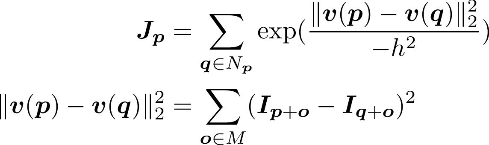
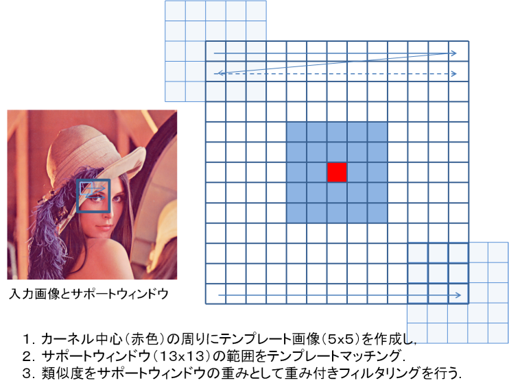

# エッジ保存平滑化フィルタの高速化 （総合演習用（オプショナル））

## バイラテラルフィルタ（カラー画像限定）
エッジを残しながら，平滑化を行うエッジ保存平滑化フィルタの一つである．
空間と色の二つのガウシアン重みで平滑化を行う．
空間のガウシアン重みは，一般的なガウシアンフィルタである．
色重みは，注目画素と参照画素の色距離が遠いほど小さくなるため，エッジなどの画素値が大きく変化する部分では重みは小さくなる．

は空間方向の平滑化パラメータ，は色方向の平滑化パラメータである．

<!--
\begin{eqnarray}
\bm{J}_{\bm{p}} & = & \sum_{\bm{q}\in {N}_{\bm{p}}}G_{\sigma_s}(\bm{p}, \bm{q})G_{\sigma_r}(\bm{I}_{\bm{p}}, \bm{I}_{\bm{q}})\nonumber\\
G_{\sigma_s}(\bm{p}, \bm{q}) & = &\exp\left(\frac{(p_x-q_x)^2+(p_y-q_y)^2}{-2\sigma_s^2}\right) \qquad \bm{p} = (p_x, p_y), \bm{q} = (q_x, q_y) \nonumber\\
G_{\sigma_r}(\bm{I}_{\bm{p}}, \bm{I}_{\bm{q}}) &=& \exp\left(\frac{(r_p-r_q)^2+(g_p-g_q)^2+(b_p-b_q)^2}{-2\sigma_r^2}\right) \qquad \bm{I}_{\bm{p}} = (r_p, g_p, b_p), \bm{I}_{\bm{q}} = (r_q, g_q, b_q) \nonumber
\end{eqnarray}
-->

## ノンローカルミーンフィルタ（グレイ画像限定）
エッジを残しながら，平滑化を行うエッジ保存平滑化フィルタの一つである．
注目画素を中心とするテンプレートと参照画素を中心とするテンプレートの類似度（L2距離）から重みを計算する．
テンプレートの類似度が高いほど重みは大きくなり，低いと重みは小さくなる．
参照画素はサーチウィンドウ（サポートウィンドウ）サイズによって決まる．

<!--
\begin{eqnarray}
\bm{J}_{\bm{p}} & = & \sum_{\bm{q}\in {N}_{\bm{p}}}\exp(\frac{\|\bm{v}(\bm{p})-\bm{v}(\bm{q})\|^2_2}{-h^2}) \nonumber\\
\|\bm{v}(\bm{p})-\bm{v}(\bm{q})\|^2_2  & = & \sum_{\bm{o}\in {M}} (\bm{I}_{\bm{p}+\bm{o}}-\bm{I}_{\bm{q}+\bm{o}})^2
\end{eqnarray}

は平滑パラメータである．
は，画素を中心とするテンプレート内の全ての画素の画素値を1次元ベクトルとして表したものである．
つまり，テンプレートを1次元のベクトルとして見た場合のL2距離が類似度である．

以下の図は，テンプレートウィンドウサイズが5x5，サーチウィンドウサイズが13x13の場合の計算の方法である．

## バイラテラルフィルタ（カラー画像限定）
エッジを残しながら，平滑化を行うエッジ保存平滑化フィルタの一つである．
空間と色の二つのガウシアン重みで平滑化を行う．
空間のガウシアン重みは，一般的なガウシアンフィルタである．
色重みは，注目画素と参照画素の色距離が遠いほど小さくなるため，エッジなどの画素値が大きく変化する部分では重みは小さくなる．

は空間方向の平滑化パラメータ，は色方向の平滑化パラメータである．

<!--
\begin{eqnarray}
\bm{J}_{\bm{p}} & = & \sum_{\bm{q}\in {N}_{\bm{p}}}G_{\sigma_s}(\bm{p}, \bm{q})G_{\sigma_r}(\bm{I}_{\bm{p}}, \bm{I}_{\bm{q}})\nonumber\\
G_{\sigma_s}(\bm{p}, \bm{q}) & = &\exp\left(\frac{(p_x-q_x)^2+(p_y-q_y)^2}{-2\sigma_s^2}\right) \qquad \bm{p} = (p_x, p_y), \bm{q} = (q_x, q_y) \nonumber\\
G_{\sigma_r}(\bm{I}_{\bm{p}}, \bm{I}_{\bm{q}}) &=& \exp\left(\frac{(r_p-r_q)^2+(g_p-g_q)^2+(b_p-b_q)^2}{-2\sigma_r^2}\right) \qquad \bm{I}_{\bm{p}} = (r_p, g_p, b_p), \bm{I}_{\bm{q}} = (r_q, g_q, b_q) \nonumber
\end{eqnarray}
-->
