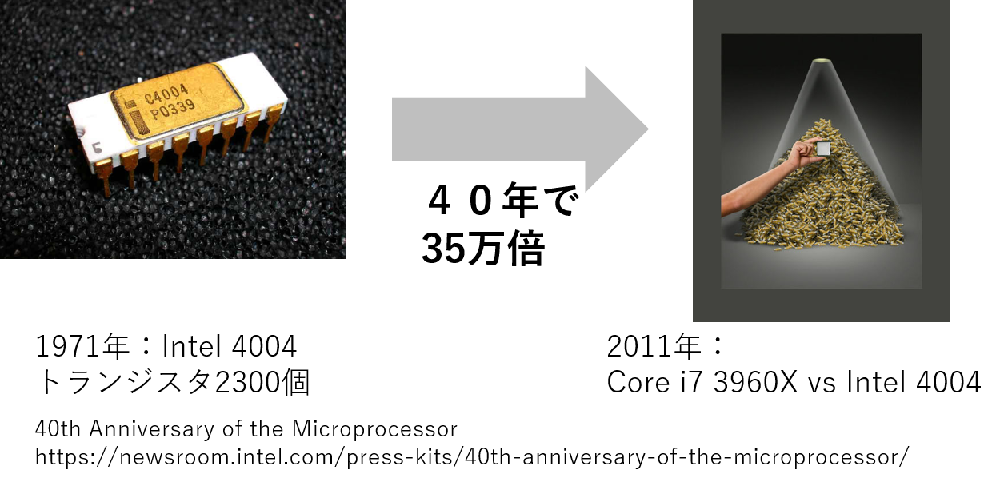

高能率計算
=========
名古屋工業大学 情報工学科 ネットワーク系分野 3年後期 ネットワーク系演習II

<!--
編集用
[マークダウンチートシート](https://gist.github.com/mignonstyle/083c9e1651d7734f84c99b8cf49d57fa)
-->

## 問題と目的
　ムーアの法則に従って集積回路のトランジスタ数は年々倍増し，その集積度は上がり続けている．
しかしながら，クロック周波数の成長は2004年ごろのPentium 4からほぼ頭打ちになっている．
これは，放熱や電力消費の制約から増加したトランジスタの用途をクロック周波数を増加させることに使うことが困難になってきたことに起因する．
その結果，増加したトランジスタの用途が，マルチコア化，ベクトルユニットの多様化やベクトル長の増加，キャッシュの大規模化，ハイパースレッディングなどの同時マルチスレッディング（SMT），ターボブースト，ビデオの符号化のためのエンコーダなどと多岐にわたっており，そのアーキテクチャは複雑化している．
（[CPUの遍歴についてはこのリンクを参照のこと.](https://qiita.com/fukushima1981/items/cb2946670dc9c7ab29ac)）


　マルチコア化が始まったIntel Core 2アーキテクチャの登場（2006年）したころから言われ始めた「フリーランチの終焉」とは，「これからはアーキテクチャに合わせたプログラミングが必要となる」というソフトウェアの性能向上をシングルコアの単純な性能向上に依存していたプログラマに対するメッセージである．
現在は，その当時よりもさらに複雑化しており，その集積回路の能力を引き出すためには，計算機のアーキテクチャを知り，そのアーキテクチャに合わせたプログラムを書く必要がある．
2017年の夏に発表されたコンシューマ向け最上位モデルであるCore i9 7980XEは18コア，512ビット（AVX-512）のベクトル演算ユニットにFMA演算ユニットを搭載しており，一秒間あたりの浮動小数演算能力（FLOPS）は理論上，シングルコアでの単純なプログラミングに比べて576倍（18コアｘ16ベクトル長ｘ2:積和演算の同時実行）の差があり，さらにはSMT，増加したL2キャッシュ，拡張されたベクトル命令セットを効率的に使うことでそれ以上の性能差が生まれる．

　しかし，このムーアの法則は終焉を迎えつつあり，これからのアーキテクチャの変化は予測できない．
そのため，複雑化・多様化する演算装置の成長へのフリーランチは，もはや期待できない．
そこで本演習では，計算機の性能を引き出すためのプログラミング技術について学ぶ．

　本講義では，以下のトピックスについては **取り扱わない**．
しかし，ハイパフォーマンスコンピューティングにとっては主要な話であるため，必要に応じて各自学ぶと良い．

* GPGPU
  - GPUを使った並列化計算
* FPGA
  - FPGAを使った回路設計
* ノード間並列化．今回はノード内並列化
  - PCクラスタ
  - MPI
  - Map Reduceなどの高スケーラビリティな並列化



## 演習環境
　本演習では，Linux上で実行することを想定してる．
具体的な動作環境は以下の通りである．
* コンパイラ：g++ version 4.8.5
* CPU： Intel Core-i5 7500 (4 core 4 thread @3.4GHz) or Intel Xeon Platinum 8160 x8 CPU (24 core 48 thread @2.1GHz)

　なお，本プログラムはWindows上のVisual Studioで大まかに開発したのちに，Linuxで動くように確認してる．
そのため，VisualStudioのソリューションファイルも提供しているが，そちらを使う分にはノーサポートとなる．
VisualStudioの使用に習熟した人のみの利用を想定している．
（そもそも動かない関数などを使用しているところが一部ある．VisualStudioで動かすためにはどうしたらいいのかの質問には答えない．）

　また，一部の記述において，初学者向けに理解を促すために，厳密な定義とは異なることがあることに注意されたい．

## 関連科目
* プログラミングI・II・III・応用
* コンピュータアーキテクチャI・II（共通）
* オペレーティングシステム（共通）
* コンパイラ（ネットワーク）
* プログラミング言語論（ネットワーク）

## 参考リンク
* [RIKEN:計算科学技術特論A (2017)](http://www.r-ccs.riken.jp/library/event/tokurona_170406.html)
* [RIKEN:計算科学技術特論B (2018)](http://www.r-ccs.riken.jp/library/event/tokuronB_180406.html)
* [Intel Intrinsics Guide](https://software.intel.com/sites/landingpage/IntrinsicsGuide/)
* [x86/x64 SIMD命令一覧表（SSE～AVX2）](https://www.officedaytime.com/tips/simd.html)
* [計算科学概論](https://www.eidos.ic.i.u-tokyo.ac.jp/~tau/lecture/cs_alliance/)
* [組み込み関数（intrinsic）によるSIMD入門](https://www.slideshare.net/FukushimaNorishige/simd-10548373)
* [マルチコアを用いた画像処理](https://www.slideshare.net/FukushimaNorishige/ssii-33751285)
* [計算機アーキテクチャを考慮した高能率画像処理プログラミング](https://www.slideshare.net/FukushimaNorishige/ss-83087912)
* [プログラムを高速化する話](https://www.slideshare.net/KMC_JP/ss-45855264)
* [プログラムを高速化する話Ⅱ GPGPU編](https://www.slideshare.net/KMC_JP/gpgpu-91122680)
* [x86 Intrinsics Cheat Sheet](https://db.in.tum.de/~finis/x86-intrin-cheatsheet-v2.1.pdf)

## 参考図書
* [コンピュータの構成と設計 第5版 上（デイビッド A パターソン, ジョン Ｌ ヘネシー）](https://www.amazon.co.jp/%E3%82%B3%E3%83%B3%E3%83%94%E3%83%A5%E3%83%BC%E3%82%BF%E3%81%AE%E6%A7%8B%E6%88%90%E3%81%A8%E8%A8%AD%E8%A8%88-%E7%AC%AC5%E7%89%88-%E4%B8%8A-%E3%82%B8%E3%83%A7%E3%83%B3-L-%E3%83%98%E3%83%8D%E3%82%B7%E3%83%BC/dp/4822298426/ref=tmm_hrd_swatch_0?_encoding=UTF8&qid=&sr=)
* [コンピュータの構成と設計 第5版 下（デイビッド A パターソン, ジョン Ｌ ヘネシー）](https://www.amazon.co.jp/%E3%82%B3%E3%83%B3%E3%83%94%E3%83%A5%E3%83%BC%E3%82%BF%E3%81%AE%E6%A7%8B%E6%88%90%E3%81%A8%E8%A8%AD%E8%A8%88-%E7%AC%AC5%E7%89%88-%E4%B8%8B-%E3%83%87%E3%82%A4%E3%83%93%E3%83%83%E3%83%89%E3%83%BB-%E3%83%BB%E3%83%91%E3%82%BF%E3%83%BC%E3%82%BD%E3%83%B3/dp/4822298434/ref=sr_1_2?s=books&ie=UTF8&qid=1534462491&sr=1-2&keywords=%E3%82%B3%E3%83%B3%E3%83%94%E3%83%A5%E3%83%BC%E3%82%BF%E3%81%AE%E6%A7%8B%E6%88%90%E3%81%A8%E8%A8%AD%E8%A8%88)
* [コンピュータアーキテクチャ 定量的アプローチ第5版（ジョン Ｌ ヘネシー，デイビッド A パターソン）](https://www.amazon.co.jp/%E3%83%98%E3%83%8D%E3%82%B7%E3%83%BC-%E3%83%91%E3%82%BF%E3%83%BC%E3%82%BD%E3%83%B3-%E3%82%B3%E3%83%B3%E3%83%94%E3%83%A5%E3%83%BC%E3%82%BF%E3%82%A2%E3%83%BC%E3%82%AD%E3%83%86%E3%82%AF%E3%83%81%E3%83%A3-%E5%AE%9A%E9%87%8F%E7%9A%84%E3%82%A2%E3%83%97%E3%83%AD%E3%83%BC%E3%83%81%E7%AC%AC5%E7%89%88-%E3%82%B8%E3%83%A7%E3%83%B3%E3%83%BBL%E3%83%BB%E3%83%98%E3%83%8D%E3%82%B7%E3%83%BC/dp/4798126233/ref=pd_sim_14_2?_encoding=UTF8&pd_rd_i=4798126233&pd_rd_r=0c96e5d2-a1ad-11e8-9fb6-8b881282ab55&pd_rd_w=tbykW&pd_rd_wg=OfRfg&pf_rd_i=desktop-dp-sims&pf_rd_m=AN1VRQENFRJN5&pf_rd_p=053a78c4-e34f-47d4-9426-4d23f47a211d&pf_rd_r=N9MWCV9NRNWFBSP8WWZE&pf_rd_s=desktop-dp-sims&pf_rd_t=40701&psc=1&refRID=N9MWCV9NRNWFBSP8WWZE)
* [コンパイラの構成と最適化（中田 育男）](https://www.amazon.co.jp/%E3%82%B3%E3%83%B3%E3%83%91%E3%82%A4%E3%83%A9%E3%81%AE%E6%A7%8B%E6%88%90%E3%81%A8%E6%9C%80%E9%81%A9%E5%8C%96-%E4%B8%AD%E7%94%B0-%E8%82%B2%E7%94%B7/dp/4254121776)
* [並列プログラミング入門: サンプルプログラムで学ぶOpenMPとOpenACC（片桐 孝洋）](https://www.amazon.co.jp/%E4%B8%A6%E5%88%97%E3%83%97%E3%83%AD%E3%82%B0%E3%83%A9%E3%83%9F%E3%83%B3%E3%82%B0%E5%85%A5%E9%96%80-%E3%82%B5%E3%83%B3%E3%83%97%E3%83%AB%E3%83%97%E3%83%AD%E3%82%B0%E3%83%A9%E3%83%A0%E3%81%A7%E5%AD%A6%E3%81%B6OpenMP%E3%81%A8OpenACC-%E7%89%87%E6%A1%90-%E5%AD%9D%E6%B4%8B/dp/4130624563/ref=sr_1_1?s=books&ie=UTF8&qid=1534462719&sr=1-1&keywords=OpenMP)
* [スパコンプログラミング入門: 並列処理とMPIの学習（片桐 孝洋）](https://www.amazon.co.jp/%E3%82%B9%E3%83%91%E3%82%B3%E3%83%B3%E3%83%97%E3%83%AD%E3%82%B0%E3%83%A9%E3%83%9F%E3%83%B3%E3%82%B0%E5%85%A5%E9%96%80-%E4%B8%A6%E5%88%97%E5%87%A6%E7%90%86%E3%81%A8MPI%E3%81%AE%E5%AD%A6%E7%BF%92-%E7%89%87%E6%A1%90-%E5%AD%9D%E6%B4%8B/dp/4130624539/ref=la_B00LZHFNEU_1_2?s=books&ie=UTF8&qid=1534462807&sr=1-2)
* [構造化並列プログラミング―効率良い計算を行うためのパターン（マイケル・マックール）](https://www.amazon.co.jp/%E6%A7%8B%E9%80%A0%E5%8C%96%E4%B8%A6%E5%88%97%E3%83%97%E3%83%AD%E3%82%B0%E3%83%A9%E3%83%9F%E3%83%B3%E3%82%B0%E2%80%95%E5%8A%B9%E7%8E%87%E8%89%AF%E3%81%84%E8%A8%88%E7%AE%97%E3%82%92%E8%A1%8C%E3%81%86%E3%81%9F%E3%82%81%E3%81%AE%E3%83%91%E3%82%BF%E3%83%BC%E3%83%B3-%E3%83%9E%E3%82%A4%E3%82%B1%E3%83%AB%E3%83%BB%E3%83%9E%E3%83%83%E3%82%AF%E3%83%BC%E3%83%AB/dp/4877833056/ref=pd_sbs_14_5?_encoding=UTF8&pd_rd_i=4877833056&pd_rd_r=b4ee6b1b-a1b0-11e8-9fb6-8b881282ab55&pd_rd_w=tqQhq&pd_rd_wg=Ag4YE&pf_rd_i=desktop-dp-sims&pf_rd_m=AN1VRQENFRJN5&pf_rd_p=cda7018a-662b-401f-9c16-bd4ec317039e&pf_rd_r=Y7JQJDBYDK79N2AXJZBT&pf_rd_s=desktop-dp-sims&pf_rd_t=40701&psc=1&refRID=Y7JQJDBYDK79N2AXJZBT)
* [高速化プログラミング入門（北山 洋幸）](https://www.amazon.co.jp/%E9%AB%98%E9%80%9F%E5%8C%96%E3%83%97%E3%83%AD%E3%82%B0%E3%83%A9%E3%83%9F%E3%83%B3%E3%82%B0%E5%85%A5%E9%96%80-%E5%8C%97%E5%B1%B1-%E6%B4%8B%E5%B9%B8/dp/4877833870/ref=pd_rhf_dp_p_img_5?_encoding=UTF8&psc=1&refRID=TB348HBY79RMFJJH77AY)
* [プロセッサを支える技術－－果てしなくスピードを追求する世界（Hisa Ando）](https://www.amazon.co.jp/%E3%83%97%E3%83%AD%E3%82%BB%E3%83%83%E3%82%B5%E3%82%92%E6%94%AF%E3%81%88%E3%82%8B%E6%8A%80%E8%A1%93-%EF%BC%8D%EF%BC%8D%E6%9E%9C%E3%81%A6%E3%81%97%E3%81%AA%E3%81%8F%E3%82%B9%E3%83%94%E3%83%BC%E3%83%89%E3%82%92%E8%BF%BD%E6%B1%82%E3%81%99%E3%82%8B%E4%B8%96%E7%95%8C-WEB-DB-PRESS-plus/dp/4774145211/ref=pd_sim_14_97?_encoding=UTF8&pd_rd_i=4774145211&pd_rd_r=564d946c-a1b4-11e8-9d84-25270957ff53&pd_rd_w=pjDUu&pd_rd_wg=TMkH9&pf_rd_i=desktop-dp-sims&pf_rd_m=AN1VRQENFRJN5&pf_rd_p=053a78c4-e34f-47d4-9426-4d23f47a211d&pf_rd_r=7GV789RMBET9ZE9FAH5X&pf_rd_s=desktop-dp-sims&pf_rd_t=40701&psc=1&refRID=7GV789RMBET9ZE9FAH5X)
* [コンピュータアーキテクチャ技術入門 ~高速化の追求×消費電力の壁（Hisa Ando）](https://www.amazon.co.jp/%E3%82%B3%E3%83%B3%E3%83%94%E3%83%A5%E3%83%BC%E3%82%BF%E3%82%A2%E3%83%BC%E3%82%AD%E3%83%86%E3%82%AF%E3%83%81%E3%83%A3%E6%8A%80%E8%A1%93%E5%85%A5%E9%96%80-%E9%AB%98%E9%80%9F%E5%8C%96%E3%81%AE%E8%BF%BD%E6%B1%82%C3%97%E6%B6%88%E8%B2%BB%E9%9B%BB%E5%8A%9B%E3%81%AE%E5%A3%81-WEB-PRESS-plus/dp/4774164267/ref=pd_sim_14_2?_encoding=UTF8&pd_rd_i=4774164267&pd_rd_r=6a50425c-a1b4-11e8-88fd-59ccc6f09d99&pd_rd_w=AHRk1&pd_rd_wg=8FIoI&pf_rd_i=desktop-dp-sims&pf_rd_m=AN1VRQENFRJN5&pf_rd_p=053a78c4-e34f-47d4-9426-4d23f47a211d&pf_rd_r=P0QYFJEX2MYX882CWE20&pf_rd_s=desktop-dp-sims&pf_rd_t=40701&psc=1&refRID=P0QYFJEX2MYX882CWE20)
* [数値計算の常識（伊理 正夫, 藤野 和建）](https://www.amazon.co.jp/%E6%95%B0%E5%80%A4%E8%A8%88%E7%AE%97%E3%81%AE%E5%B8%B8%E8%AD%98-%E4%BC%8A%E7%90%86-%E6%AD%A3%E5%A4%AB/dp/4320013433/ref=pd_sim_14_59?_encoding=UTF8&pd_rd_i=4320013433&pd_rd_r=564d946c-a1b4-11e8-9d84-25270957ff53&pd_rd_w=pjDUu&pd_rd_wg=TMkH9&pf_rd_i=desktop-dp-sims&pf_rd_m=AN1VRQENFRJN5&pf_rd_p=053a78c4-e34f-47d4-9426-4d23f47a211d&pf_rd_r=7GV789RMBET9ZE9FAH5X&pf_rd_s=desktop-dp-sims&pf_rd_t=40701&psc=1&refRID=7GV789RMBET9ZE9FAH5X)

## 予定表
* 1週：導入，最適化コンパイラとパフォーマンス測定方法，古典的な高速化技法（演算量の削減・置換，テーブル参照，固定小数点など）
* 2週：メモリとキャッシュの最適化（行列演算）
* 3週：並列化プログラミング（OpenMPによる並列化）
* 4週：ベクトル化プログラミング．IntrinsicsによるAVXベクトル化
* 5週：ベクトル化プログラミング．IntrinsicsによるAVXベクトル化
* 6週：総合演習：6-7週通しで何かを高速化する
* 7週：総合演習：6-7週通しで何かを高速化する

# チュートリアル
　例題のコードはC言語の疑似コードであって，コンパイルできるとは限らない．
実際に使うコードは以下のコードを参照すること．
本演習では，主に行列の演算と画像処理のコードを拡張して用いる．
* [演習用コードと行列演算ライブラリ](https://github.com/fukushimalab/hpc_exercise/tree/master/src/hpc-exercise)
* [画像処理ライブラリとサンプルコード](https://github.com/fukushimalab/hpc_exercise/tree/master/src/image-processing)

また，これらのコードの使用方法については，以下のリンクより確認すること．
* [演習用コードと行列演算ライブラリの説明](ライブラリ説明.md)
* [画像処理ライブラリの説明と演習](画像処理.md)
* [画像処理高速化演習](ボックスフィルタ.md)

なお，リンク先には，ライブラリの使用になれるためにチュートリアル課題がある．
このチュートリアル課題に関してはレポートで報告する必要はない．

ただし，画像処理に関しては，発展課題の記述もある．
そちらは適宜レポートに含めること．（章末にある）

## 注意

### 各課題について
　発展と書いてある項目には課題はついていないため，より発展した学習がしたい人のための自習用となっている．

### 名工大のCSEについて
　計算資源は，CSEのメインフレームではなく，ローカル環境を使用すること．
ターミナルで`kterml`と打つことで，使用しているローカルPCの環境で実行することが可能となる．
（全員が，同時にメインフレームのマルチコアを使うと計算速度にばらつきが大きく出るため．）
詳細は，下記のページを参照のこと．

[ローカル環境の使用の仕方](http://cse.cs.nitech.ac.jp/centos_login/centos_login.html)

### Makefileについて
　コンパイルにはmakeコマンドを使用すること．
Makefileには，既に必要なオプションが記述されている．
もしコンパイルオプションを変更する場合は，`CXXFLAG_ST`を編集すること．
また，`CXXFLAG`は必要なコンパイルオプションであるため，変更しないように注意すること．
また，このMakefileはコンパイルの最後にCSEかlocal環境か分かるような表示がある．
もし名工大CSEを使わない場合には，Makefile_notNIT_Userをリネームして使うこと．


### エディタについて
編集するエディタについては，Visual Studio Codeで書くと楽になる人が多い．
ただし，Vim，Emacsを自分用にカスタマイズしている人はもちろんそちらを使ってよい．

### 仮想デスクトップについて
使用する計算機環境では，プログラムを編集するには画面が小さい．
その場合は，仮想デスクトップの機能を使うこと．
詳しくは仮想デスクトップで検索．
ショートカットキーのctrl+alt+→やctrl+alt+←で仮想デスクトップが切り替わる．

#### 課題0
ファイルをダウンロードしてコンパイル＆実行せよ．
本課題では，コンパイルはmakeコマンドで可能である．(gcc hoge.cなどと打つ必要はない．)
以下のコマンドを打てばmake可能である．
```
> make
```
実行は下記コマンドで可能である．
```
> ./hpc_exercise
```

また，仮想デスクトップで画面を切り替えよ．
ショートカットキーのctrl+alt+→やctrl+alt+←で仮想デスクトップが切り替わる．
___
# 1. 最適化コンパイルとパフォーマンス測定方法

　プログラムは，書いたとおりに動く．
しかし，プログラムは人によって異なる書き方がされ，書かれたプログラムによって実行速度が違う．
そのため，計算機の性能を引き出すためには適切にプログラムを書かなければならない．

　しかし，プログラムを書き直すには時間を要し，加えて新たにバグを埋め込む可能もある．
特にプログラムの開発中では，必要な機能が時々刻々と変化するため，せっかく書き換えたプログラムの必要がなくなる可能性もある．
また，作っている部分のコードは，全体の計算時間に占める割合が低いかもしれない．

```
Rules of Optimization:
Rule 1: Don't do it.
Rule 2 (for experts only): Don't do it yet. ” - Michael A. Jackson

最適化の法則：
１．するな．
２．まだするな（エキスパート専用）
```
という言葉があるように，プログラム最適化してプログラムを速くすることを戒める言葉がある．
まずはコンパイラオプションやコンパイラを変えることでプログラムを変えることなく高速化できるかどうか試すべきである．

```
We should forget about small efficiencies, say about 97% of the time: premature optimization is the root of all evil.
Yet we should not pass up our opportunities in that critical 3% ?
Donald Knuth

小さな効率のことなんて気にするべきではない（97%くらい）．早まった最適化は諸悪の根源である．
しかし，残った３％の機会を逃すべきではない．
ドナルド・クヌース
```
しかし，わずかな変更で大幅に高速化する場合もある．
もし，プログラムを最適化することを決断したら，即座に該当箇所のコードを変更し，プログラムを高速化したくなる．
しかしながら，プログラムの変更によって必ずしも速くなるとは限らない．
加えて，プログラムの変更によってバグが混入し，計算結果が違ってくる可能性もある．

```
Rule 2. Measure. Don't tune for speed until you've measured, and even then don't unless one part of the code overwhelms the rest.
Robert C. Pike

計測しろ．計測するまで，速度のためのチューニングはしてはならない．コードの一部が計算時間の大半を占めないのであれば，なおさらである．
ロバート・パイク
```
という言葉があるように，高速化するためにはまずは時間計測や，プログラムが高速化する前と同じ結果を出力するか検証するコードを書く必要がある．

　本演習では，まずプログラムの検証の仕方を学ぶために，時間計測方法やパフォーマンス計測方法，正解を検証する方法を示す．
対象となるプログラムは，任意のサイズの行列積を計算するプログラムである．
なお，一部の内容は，プログラミング応用でも触れている．

## 計算時間の計測方法
### timeコマンド
`time`コマンドはプログラムの実行時間全体を計測する．

```
time program 引数1 引数2 ...
```
例えば以下のコマンドは，3秒間のスリープコマンドを時間計測している．
```
$ time sleep 3
```
結果は以下のように返ってくる．
```
real    0m3.008s
user    0m0.000s
sys     0m0.000s
```
これは，スリープコマンドにかかった実時間が3.008秒であることを示している．
このコマンドはプログラムの修正なしに実行できるため簡便に利用することができる．
しかし，どの部分がどれだけかかったかわからないため，詳細な分析をするときは以下の時間計測関数を用いる．

### タイマーの挿入
　より精度良く時間を計測する場合や，前処理や後処理を含めず特定の部分の処理時間を計測したい場合が多々存在する．
その場合は，コードの計測したい部分の開始時刻と終了時刻を計測し，その差分から計算時間を算出する．
計算時間の測定には，複数回実行するループを書き，その平均値や中央値をとるなどすると，より正確な速度が計測できる．
特に，計算量が小さな場合は，数百，数千といった試行回数をとる必要がある．

　本演習では，時間計測関数として，clock_gettime関数を使用する．
clock_gettime関数を使用することによって、該当箇所の処理時間を計測することができる．
```cpp
timespec start, end;
clock_gettime(CLOCK_REALTIME, &start);
//計測したい処理
clock_gettime(CLOCK_REALTIME, &end);
double time = (double)(end.tv_sec-start.tv_sec)*1e3 + (double)(end.tv_nsec-start.tv_nsec)*1e-6; //[ms]
```
タイマー計測関数はいろいろあり，精度も異なる．また，OSによって用意されている関数も異なる．
この時間計測関数は，本演習環境を想定した精度の高いタイマーである．

### 時間計測クラス
　本演習では，時間計測を簡素化するために，CalcTimeクラスを提供している．
CalcTimeは次の様に使用する．
```cpp
CalcTime t;
for(int i=0;i<10;i++)
{
  t.start(); //計測開始
  //計測したい処理
  t.end(); //計測終了
  double tl = t.getLastTime();  //最後に計測した時間を取得
}
double tavg = t.getAvgTime();  //t.getAvgTime(true);も同様．計測した時間の平均（1回目の計測時間を除外）[ms]
// double tavg= t.getAvgTime(false);  //計測した時間の平均（1回目の計測時間を含む）[ms]
```
　1回目の処理は，データがキャッシュに入っていないなどの理由で，2回目以降の処理に比べて時間がかかる（どの処理時間が正しいのかは，どのような用途を対象としているのかで異なる）．
そこで，`getAvgTime()`もしくは`getAvgTime(true)`では，1回目の計測した時間を除外する．
`getAvgTime(false)`では，1回目の計測時間も含めた平均が出力される．
また，`getAvgTime()`メソッドは，呼び出すとデフォルトで計算結果をクリアし，初期化される．
途中結果等を見たいように使う場合は，`getAvgTime(true, false)`など第2引数をfalseにしてクリアすること．
#### 課題1
行列積和演算AX+Bを計算するプログラムにおいて，行列積と和それぞれの実行時間をタイマーを挟むことで測定せよ．
なお，デフォルトのサンプルコードには行列積の後，和をとるプログラムがサンプルとして書かれている．

また，１度目の計算時間は，２回目以降よりも統計的に遅いことを確認せよ．
なお，以下の課題ではほとんどの場合で実行速度を計測する．  
繰り返し回数が少ない場合，計算機のパフォーマンスの揺らぎにより結果が埋もれる場合がある．  
その場合は，適切に繰り返し回数を適宜増やして実験をすること．

** 計算時間は，原則平均のavgのみを示すこと．ただし，複数の試行回数が必要な場合のみすべて表示せよ**  
これは，無駄に計算時間が張り付けられたレポートの確認が大変なことが理由であるため，必ず留意すること．
### perfコマンド（発展）
perfコマンド（Performance analysis tools for Linux）とは，プログラムの性能を解析するためのプログラムである．
これは，作成したプログラムのパフォーマンスの詳細を分析したいときに使い，timeコマンドやタイマーを挟む以上のプログラムの詳細な分析がしたい場合に用いる．
なお，Windows用は無いが近いものはある．
詳細は以下のリンクなどを参照のこと．

* [perfの使い方](http://int.main.jp/txt/perf/)
* [perf使ってみた](https://qiita.com/saikoro-steak/items/bf066241eeef1141ef5f)
* [Perf Wiki](https://perf.wiki.kernel.org/index.php/Main_Page)

## 最適化コンパイル
### コンパイルオプションによる速度の違い
コンパイラオプションを変えればコンパイルされるプログラムのアセンブリが異なってくる．
（※アセンブラは機械語に変換するプログラムのこと．アセンブルは機械語に変換すること．アセンブリが言語．つまりアセンブラがアセンブルしてアセンブリになる．アセンブラ言語じゃなくてアセンブリ言語．厳密な話をするとき以外，細かいことはそんなに気にされてない．）

例えば，以下のオプションを使えば実行速度が変化する．
```
g++ -O0 test.c　（最適化なし）
g++ -O1 test.c　（最適化弱）
g++ -O2 test.c　（最適化中）
g++ -O3 test.c　（最適化大）
g++ -Ofast test.c　（最適化最大．ただしコンパイラが新しくないと対応していない．）
g++ -Os test.c　（プログラムサイズの最適化）
g++ -Og test.c　（デバッグ用最適化）
```
そのほかにも様々なオプションがある．
```
g++ -O3 -mtune=native -march=native -mfpmath=both
```

`-mtune=native -march=native`は，バイナリファイルをローカルマシンに最適化する．
`-mfpmath=both`は，浮動小数点演算とsseやavxといったSIMD命令を使ったコードを生成するようになる．
これらの有効だと思われる最適化は-Ofastで一式有効化される．
詳細は以下を参照のこと．

[g++ 最適化オプション](http://kaworu.jpn.org/cpp/g++_%E6%9C%80%E9%81%A9%E5%8C%96%E3%82%AA%E3%83%97%E3%82%B7%E3%83%A7%E3%83%B3)

なお，本講義の多くのプログラムでC++を一部使っているためコンパイラはg++を使うこと．
これは，C言語だけで記述すると，演習で記述するコード量が長くなるからである．
ただし，本学の課程では，JavaとC言語しか履修していないことを前提にして，C++をほぼC言語として使っている．
C++が書ける人は，サンプルコードや具体的な指示を無視してC++の機能を使ってコードを書いてもよい．

なお，本課題は，コマンドを何度も打たなくてよいように，Makefileでオプションが指定されている．
つまり，上記の`g++`のオプション指定は，Makefileの編集で行う．

Makefileには，既に必要なオプションが記述されており，`CXXFLAGS`や`CXXFLAGS_ST`が該当する．
もしコンパイルオプションを変更する場合は，`CXXFLAG_ST`を編集すること．
また，`CXXFLAG`は必要なコンパイルオプションであるため，変更しないように注意すること．
例えば，`CXXFLAGS_ST`の`-O3`や`#-mtune=native`はデフォルトでは`#`記号によってコメントアウトされているが，この`#`を削除すればオプションがそれぞれ有効化される．

また，`CC`では`g++`を指定しているが，`icc`とすればインテルコンパイラが起動する．
その場合はそれぞれ適切なオプションを指定して使うこと．

また，このMakefileはコンパイルの最後にCSEかlocal環境か分かるような表示がある．
もし名工大CSEを使わない場合には，Makefile_notNIT_Userをリネームして使うこと．

```Makefile
PROGRAM=hpc_exercise
OBJS=utils/mat.o utils/mat_util.o main.o

CC = g++
CXXFLAGS=-lm -std=c++0x -fopenmp -march=native -mfpmath=both
CXXFLAGS_ST=#-O3 #-mtune=native


.SUFFIXES: .cpp .o

.PHONY: all
all: depend $(PROGRAM)

$(PROGRAM): $(OBJS)
	$(CC) $(CXXFLAGS) $(CXXFLAGS_ST) -o $(PROGRAM) $^
	-@ utils/check_host.sh

.c.o:
	$(CC) $(CXXFLAGS) -c $<

.PHONY: clean
clean:
	$(RM) $(PROGRAM) $(OBJS) depend.inc

.PHONY: depend
depend: $(OBJS:.o=.cpp)
	-@ $(RM) depend.inc
	-@ for i in $^; do cpp -MM $$i | sed "s/\ [_a-zA-Z0-9][_a-zA-Z0-9]*\.cpp//g" >> depend.inc; done

-include depend.inc
```

#### 課題2
行列積を計算するプログラムにおいて，コンパイラオプションを変えて計算速度の計測し，その違いを観測せよ．

### コンパイラによる速度の違い（発展）
コンパイラには，gcc以外にもVisual Studioのvc，IntelコンパイラのiccやLLVM Clangなどがあり，コンパイラによって最適化できる程度が違う．
例えば，iccはインテルのCPUに特化したコードを生成することができる．
ただし，最適化に時間がかかるためコンパイル時間は長くなりやすい．
例えば以下のオプションを使うとiccで最大限の最適化が働く．
```
icc -fast test.c
```
**なお，本演習では，現在clangは動作しないがiccは動作する．**

___
# 2. 古典的な高速化技法
　ここからプログラムを書き換えることでプログラムを高速化することを目指す．
プログラムを高速化するためには以下３つのアプローチが考えられる．
1. 命令の実行回数を減らす．
2. より速い命令を使う．
3. 並列度を上げる．

本章では，1, 2に相当する演算量の削減，演算の置き換えによる高速化技法を学ぶ．
また，関数呼び出しや条件分岐の削減による高速化を学ぶ．
3については，後の章で述べる．

ただし，コンパイラが自動で同等のことをやってくれる可能性もあるため，速度が向上するとは限らない．
場合によってはパイプラインの最適化を乱し，速度が低下する場合もある．
そのため，計測は必要不可欠である．

***備考***

　本章で行うようなコード書きかえによる最適化は，可読性が下がるため，ループ内など大量に計算が発生する場合に限り行うことが推奨される．
１度しか計算しないような式は，全体の計算時間に占める割合がほとんどないため，最適化する意味はない．
そのため，計算時間の主要となるループ内の処理だけに限って行うべきである．
また，コンパイラ最適化で自動的にされる場合もあるため，その場合は可読性を維持したコードのほうが望ましい．
特に，演算回数を多少削減するようなコード変更は，最適化オプションを最大に指定すれば，最近のコンパイラならほとんどやってくれることが多い．


## 演算の削減・置換
まずは，プログラミングにより演算量を削減するさまざまな方法を学ぶ．

### 括弧でくくって乗算を減らす
計算式は展開した状態で用いずに，括弧でくくったりすることで総演算回数が削減できる．
例えば以下の式の左辺では，3回の積と2回の和が必要である．
これをxを括弧でくくって外に出せば，2回の和と1回の積となり，乗算回数を削減可能である．
```
ax+bx+cx= (a+b+c)*x
```
これを一般化したものに[ホーナー法](https://ja.wikipedia.org/wiki/%E3%83%9B%E3%83%BC%E3%83%8A%E3%83%BC%E6%B3%95)があり，多項式の演算が効率化される．
なお，このアプローチは，SIMD演算の章で説明されるFMA（Fused Multiply-Add）と同時に用いることで更なる性能を発揮する．

#### 課題3
小さな行列に対して，各要素を
```math
3x[i]^4+3x[i]^3+3
```
する計算するプログラムを作成し，乗算回数を削減する前と後で計算速度を比較せよ．
ここで，x[i]は各行列の要素を表す．

注意： 行列積ではなく，要素積である．別名アダマール積．各要素を計算するだけ．


### 定数項を事前に計算する
定数の乗算は事前に求めることが可能である．
それを変数として保持することで計算回数を削減可能である．
例えば，円周率に関連する計算である2πr^2と2πrの値は `a=2*π*r`と保持しておいて，`ar=a*r`としたほうが演算回数が少ない．
なお，この処理はコンパイラが自動でやってくれることが多い．

### 共通部分式の削除
数式の計算で，共通部分がある場合，その計算を先にやっておき一時変数として格納しておくと，演算が削除できる．

```cpp
d = a + b + c;
f = d + a + b;
```

```cpp
temp = a + b;
d = temp + c;
f = d + temp;
```

#### 課題4
小さな行列に対して，各要素xを下記の定数倍するプログラムを作成し，数式の展開前後で計算速度を比較せよ．
<!--
$$
(2\pi+\sqrt{5}+0.5^2) \times x
$$
-->


### 除算を避ける
除算は四則演算の中でももっとも実行時間が長いためできる限り避けるべきである．
除算は，逆数にすれば乗算に変更できるため，乗算にすることで演算を高速化できる．
例えば，4の除算は0.25倍に置き換えることができる．
```
y=x/4.0 -> y=x*0.25
```
除算から，乗算への変換は，演算の有効桁数が変わるためコンパイラ最適化ではされにくい．
ただし，これを使う場合は，有効桁数の扱いなどに注意すること．
なお，x/4とx/4.0，x/4.0fの計算速度は異なる．
これは，後の課題にある型による計算速度の影響を受けている．
それぞれ，整数型での除算，double型での除算，float型での除算に相当しており，整数，float, doubleの順で速度が遅くなる．


#### 課題5
小さな行列に対して，各要素を3.141592で除算する計算するプログラムを作成し，除算を避ける場合とそうでない場合で計算速度を比較せよ．
大きな行列で行うと，効果が少ない可能性があるため注意すること．

### 乗算を避ける
`x*2`は`x+x`で表現できる．乗算よりも加算のほうが軽いため，こちらのほうが速い．
ただし，現代のアーキテクチャだと，浮動小数点演算は乗算も加算もコストは変わらないため効果はほぼない．
整数演算の場合は変わる可能性がある．

### 除算を減らす
除算は重たいため，少しでも減らすべきである．
以下の数式は式展開により除算が削減可能である．

```cpp
(a/b)*(c/d) = (a*c)/(b*d)
```
このように，数式を見て除算が減らせそうな場合は減らすように計算する．

#### 課題6
小さな4つの行列A, B, C, Dに対して，行列の各要素ごとに`(a/b)*(c/d)`を計算するプログラムを作成し，除算を削減する前と後で計算速度を比較せよ．

### べき乗をさける
`x^2`は`x*x`で表現したほうが速い．
対数計算であるpow命令は重たいため，累乗が固定値で小さい場合は展開して乗算にしたほうが速い．
```cpp
const int size = 1024;
float data[size]
for(int i=0;i<size;i++)
	data[i]=pow(i,2);
```
```cpp
const int size = 1024;
float data[size]
for(int i=0;i<size;i++)
	data[i]=i*i;
```

#### 課題7
累乗を3乗，4乗．．．n乗としたときに速度がどうなるのか計測せよ．ただし，累乗をすると値が大きくなるため，浮動小数点の最大値を超える可能性がある．その時は入力データを0.1倍`（i*0.1）`などすること．

### 小さな型や整数を使う
整数型のchar, short, intは浮動小数点演算よりも計算が速く，またメモリ使用量はcharが１バイト，shortが２バイト，intが４バイトと小さい．
一方，浮動小数点演算のfloatとdoubleは，floatのほうがdoubleよりも速くメモリ使用量はfloatが４バイト，doubleが８バイトである．
そのため，必要な有効桁数が小さい場合や，整数でよい場合はより小さな型で計算したほうが速くなる．

#### 課題8
２つの行列の和を`unsigned char, short, int, float, double`で計算しそれぞれ比較せよ．
なお，大きい行列サイズでないと，効果がでない場合がある．

### 整数の乗算・除算をビットシフトに
2の倍数の整数の乗算，除算はビットシフトに置き換えることができる．
例えば，以下のように，2倍するなら1ビット左シフト，半分なら右シフトで実行できる．
```
y=x*2 -> x<<1,  y=x/2 -> x>>1
```

#### 課題9
intの行列を整数で2倍，浮動小数点で2.f倍,整数を１ビットだけビットシフトすることで2倍する場合の計算速度を比較せよ．

また，intの行列を整数で2で除算する場合，浮動小数点で2で除算する場合，浮動小数点の0.5で乗算する場合，１ビットだけビットシフトすることで1/2倍する場合の速度を比較せよ．

加えて，floatの行列で，2.0で除算する場合と0.5で乗算する場合を比較せよ．

なお，浮動小数点で乗算する場合は整数の場合よりも遅い．
また，大きい行列サイズでないと，効果がでない場合がある．

### 固定小数点
浮動小数点は，整数演算を除算することでも作成することができる．
例えば，3.141は3141/1,000で表現可能である．
しかし，除算計算は重たいため，それをビットシフトで置き換える．
1,000に近い2のべき乗は，2^10=1,024であり，小数点を四捨五入すれば，以下で表すことができる．
```cpp
3141*(1024/1000)/1024 = 3216>>10
```
特にこの固定小数点は，定数値の四則演算に有効であり，例えば乗算することを考えれば，以下のように置き換えられる．
```cpp
3.141*x -> (3216*x)>>10
```

#### 課題10
floatの行列をを3.141倍する場合と，intの行列を3.141倍を固定小数点で行う場合で計算し比較せよ．
なお，小さい行列では，効果が出ない場合がある．

### テーブル参照
`sin, cos, exp, log, sqrt`といった関数は，内部的にテイラー展開などの多項式演算で数値計算により求めている．
そのため，これらの関数の計算は，単純な四則演算よりも非常に重たい．
もし，これらの関数の引数が整数ならば，これらの計算結果を事前に求めて配列に保存しておけば，計算せずとも計算結果を配列から参照するだけで良い．
この方法をルックアップテーブルやテーブル参照と呼ぶ．
例えば，expの計算において，引数xが0-255の範囲内かつ整数しか発生しない場合は，以下のようにテーブルを作成すればよい．
```cpp
float EXP[256]
for(int i=0;i<256;i++)
	EXP[i]=exp((float)i)

float data[size];
//計算する場合
for(int i=0;i<size;i++)
	data[i]=exp((float)i);
//テーブル参照の場合
for(int i=0;i<size;i++)
	data[i]=EXP[i];
```
ただし，「LUTのサイズ」＜「処理するデータサイズ」でなければ，テーブル作成のコストのほうが大きくなるため，逆に遅くなる．

#### 課題11
floatの行列への定数値の四則演算と，行列の各要素に`sin, cos, exp, log, sqrt`関数の適用した場合と計算時間を比較せよ．
また，`sin, cos, exp, log, sqrt`計算はテーブル参照も作成した場合についても比較せよ．
なお，環境によっては，演算したほうが速い演算もある可能性がある．

また，この演習の例では，事前にテーブルを作成し，そのテーブル作成時間は計測時間に入れていない．
これは，一度テーブルを作成し，何度も同じような処理をする場合は，一度テーブルを作ったのちに何千回，何万回も実際のデータを処理した場合にテーブル作成時間が全体に占める割合が極限的には0になるためである．
もし，ループ内の処理を1度しかしない，もしくは毎回LUTの中身を更新する必要がある，テーブルのサイズが処理データよりも圧倒的に大きい場合などは，テーブル作成時間も処理に含めるべきである．
このように，目的に応じて適切に処理時間は計測する必要がある．

###	ループ内の計算をループ外に移動させる
ループ内で計算している部分が外に出せるのなら，一時変数等を用いて高速化する．
以下の例は，場合は`a*b`の乗算が外に出せる．

```cpp
float A[size]
float a = 2.f;
float b = 3.f;
for(int i=0;i<size;i++)
{
	A = a*b;
}
```

```cpp
float A[size]
float a = 2.f;
float b = 3.f;
float tmp = a*b;
for(int i=0;i<size;i++)
{
	A[i] = tmp;
}
```

また，冗長に計算してでも分岐を外に出したほうが速い場合がある．
以下の例では，ループ内に条件分岐があるため，要素ごとの処理が重くなる．
```cpp
float A[size][size]
float B[size][size]
for(int j=0;j<size;j++)
{
	for(int i=0;i<size;i++)
	{
		if(i==j)
			A[j][i]=1.0f;
		else
			A[j][i]=B[j][i];
	}
}
```

もし，ループ内の条件分岐が消せれば，処理が高速化する．
このループの条件分岐がfalseとなる場合がほとんどないため，該当部分だけ後から計算しなおしてもコストは小さい．
そのため，主要なループの計算時間を減らすために外に出し，再計算を行う．
```cpp
float A[size][size];
float B[size][size];
for(int j=0;j<size;j++)
{
	for(int i=0;i<size;i++)
	{
		A[j][i]=B[j][i];
	}
}
for(int i=0;i<size;i++)
{
	A[i][i]=1.0f;
}
```
これは，ループアンスイッチングと呼ぶこともある．
#### 課題（省略可）
上記コードを生成し，ループを外に出した場合とそのままだった場合の計算速度を比較せよ．

## 関数呼び出しの削減
### コード書き換えによる削減
関数は，呼び出すだけでコストがかかる．
そのため，関数呼び出しを減らすことで高速化可能である．
そのためには，単純に関数だった箇所をコードに埋め込み，べた書きすれば良い．
ただし，コードの可読性が著しく下がるため，ループ内などだけに限定して行うことが望ましい．

### 関数定義の局所化
コードの近い場所に関数を定義すると，関数のポインタのアドレス位置が近くなるため関数呼び出しのときにキャッシュに乗りやすくなる．
そのため，複数の関数を１つのループで複数呼び出す場合は近くにで定義しておくと高速化しやすい．

### inline展開による削減
関数が短い場合，コンパイラが関数を自動的に展開してべた書きしてくれる場合がある．
その場合は，関数にinlineの指示を出しておくと行ってくれる．
ただし，いつもやってくれるわけではなく，インライン展開されやすくなる程度である．

例えば，以下の回転を計算する小さな関数はinlineを付けることで展開される．
コードをベタ書きするよりも回転であることが明確になるため可読性が向上する．

また，`__attribute__((always_inline))` を付けると強制的にinline展開する．

```cpp
inline void rot(double a, double b, double &x, double &y, double radian)
{
	x = a*cos(radian);
	y = b*sin(radian);
}
```

#### 課題12
小さな行列A, Bの各要素を任意のradianだけ回転させて，x,yにして格納するプログラムを記述し，inline展開の有無で速度がどのように変わるか計測せよ．
また，関数をべた書きした場合とも比較せよ．

ただし，-O3のオプションを付けると強制的にinline展開される可能性がある．

## 分岐の回避（発展）
ifなどの条件分岐もコストが高い．過剰な分岐計算をループの外に出せる場合は出し，ドモルガンの法則などを用いて分岐の数が減らせる場合は削減すると高速化する．
また，if-else文でelse if文の数が多い場合，switch文に変えることで高速化が図れる．
if-else文は，コードの上から順番に条件をチェックしていくが，switch文では二分探索やテーブルジャンプを用いて効率的に条件に合うブロックを探索する．

#### 課題（省略可）
if文をドモルガンの法則で減らせる例を作成し，if文の省略前後で速度が向上するか確認せよ．

また，非常に多い条件分岐（数十個）を作成しif elase とswichを比較せよ．

___
# 3. ループとメモリとキャッシュの最適化
## 背景
　近年のCPUのクロック周波数の成長は頭打ちの状態である．
しかしCPUのFLOPSは，マルチコア化や積和演算機構，ベクトル演算機構によって未だ成長を続けている．
また，メモリ帯域も転送周波数の向上やチャネル数の増加によって成長を続けている．
しかし，メモリ帯域幅の成長は，FLOPSの成長に比べると非常に緩やかである．
特に近年は，FLOPSの成長が著しく，FLOPSとメモリ帯域幅の性能差が大きくなるばかりである．
その結果，演算速度がデータの転送速度よりも速いため，処理するためのデータのロード待ち時間が発生し，次の演算に進めないという状態が生じる．
これは，いわゆるメモリ性能に律速するした状態である．
つまり，現代の計算機において，ボトルネックは，メモリ帯域幅であることが多い．


FLOPSは，演算性能しか評価しておらず，メモリI/Oに掛かる時間を考慮していない．
つまり，計算機のピーク性能を示すためには，演算速度だけではなく，メモリI/Oも含めた性能を考える必要がある．
そのための指標として，ルーフラインモデルという理論性能を解析するモデルがある．
ルーフラインモデルでは，縦軸にFLOPS，横軸に演算強度[FLOP/Byte]と呼ばれる指標を用いる．
演算強度とは，対象とするプログラムにおける浮動小数点演算回数の総和[FLOP]をメインメモリとやりとりしたデータ量[Byte]で割ったものである．
このルーフラインモデルは，プログラムの最適化のための指針を示すものである．
例えば，メモリ帯域幅に律速していない場合は，まだ最適化によって演算性能を高めることができる余地を残していることを表している．
また，メモリ帯域に律速している場合は，演算強度を上げるようにアルゴリズムなどを変更してでも，メモリ帯域幅で律速しないようにする必要があることを示している．
これは，下記図における斜め線で限界値が頭打ちすることに相当する．
つまり，ルーフラインモデルより，対象とする計算機及びプログラムで達成可能なFLOPSは以下のように求められる．
```
達成可能なFLOPS = min(ピーク演算性能[FLOPS], ピークメモリ帯域幅[Byte/s] x 対象プログラムの演算強度[FLOP/Byte])
```


演算性能に対して，遅いメモリ帯域幅を隠蔽するための仕組みとしてキャッシュメモリによる階層構造がある．
キャッシュ機構では，使用したデータを局所性の原理（時間的局所性・空間的局所性）に従って，CPUに近いキャッシュに一時保持し，再度そのデータにアクセスする場合には，メモリではなくキャッシュにアクセスすることでデータアクセスの高速化を行う．
2010年代以降のCPUにはLevel 1 (L1) キャッシュ，Level 2 (L2) キャッシュ，Level 3 (L3) キャッシュという三つのキャッシュが存在する．
L1キャッシュが最も演算装置の近くにあり，L2，L3キャッシュの順に遠くなる．
また，最も遠いキャッシュをラストレベルキャッシュ（LLC）とも呼ぶ．
演算装置に近いキャッシュほど，高速にアクセスすることができるが，アクセス速度を高めるために大きな容量にすることができない．
そのため，キャッシュにあるデータは，Least Recently Used（LRU）などのアルゴリズムに従って入れ替えられる．
データがキャッシュにない場合をキャッシュミスと呼び，この場合は演算装置から近い順にキャッシュ内にデータがあるか確認し，全てのキャッシュにない場合はメモリからデータを取得する．
キャッシュへのアクセスはメモリへのアクセスに比べて非常に高速であり，いかにキャッシュにあるデータを使用することができるかが最適化には重要である．

そのために，考慮すべきは，局所性の原則である．
局所性の原則は，時間的局所性と空間的局所性の二つのタイプがある．
* 時間的局所性：最近アクセスされたものは，近い将来アクセスされるで可能性が高い．
* 空間的局所性：アクセスされたもののアドレスに近いものが，時間的に接近してアクセスされる傾向にある．

キャッシュはこの原則に従って格納されているため，その原則に従うようなデータアクセスを意識することがキャッシュを有効に使用する方法である．

ループ内計算は，プログラムの計算において主要な計算時間を占める
以下のループ変換の演習では，このメモリアクセスを最適化するだけでなく，並列化やベクトル化やその他の高速化テクニックとも密接に関係がある．

## メモリ確保の抑制

### `malloc/free`回数の削減
`malloc/free`はメモリ確保をしているだけで計算をしていないが，メモリ確保・解放自体も処理時間がかかる．
つまり，不必要なメモリ確保は速度を低下させる．
計算結果のバッファなど，メモリスペースの確保が必要になるときに，新たにメモリを確保するのではなく，すでに確保したメモリをできるだけ使いまわすほうが高速に処理できる．
ただし，このような最適化をすると，どこにどのデータが入っているかがわかりづらくなるため注意が必要である．

#### 課題13
行列A，Bの各要素の乗算を行うときに，結果を行列Cに格納する場合と行列Aに上書きする場合との計算時間をせよ．

### classによるメモリ管理（発展）
高効率計算の観点では，自前でメモリの確保，開放はすべて管理することが望ましい．
この場合，メモリがいつ確保されたか解放されたかが見通しやすくなるため，メモリの使用量を明示的に削減しやすくなる．
また，最初にメモリを大きく確保し，それを自前で切り分けながら管理することで，小さなメモリ領域を毎回確保する必要がなくなる．
しかし，同時にメモリ管理は，バグの温床にもなりやすい．

オブジェクト指向言語であるC++では，オブジェクト生成時に呼び出される関数であるコンストラクタでメモリの確保（malloc, new）を行い，オブジェクトを消去する際に呼び出されるデストラクタでメモリの解放（free, delete）を行えば，メモリの確保と解放を意識する必要がなくなる．
メモリの確保と解放は，バグの温床となりやすく，バグを埋め込まないためにも，またメモリ管理が簡素化されるという観点からもコンストラクタ，デストラクタを持ちいてメモリ管理をすることは覚えておくべきテクニックの一つである．
なお，本演習で使用しているMatクラスは，上記の実装となっている．
また，Javaなどの言語では，ガベージコレクションで，言語の仕様としてメモリの確保や解放が自動で行われる．

バグが少ないコードを書くには，コンストラクタやデストラクタ，またガベージコレクションによってメモリ管理をすることが好ましい．
しかし，同時それは，高効率計算の観点では，いつメモリが確保，解放されるのかが分からないということにもなる．
そのため，裏ではこのような処理が働いていることを意識しながらコードを書くことが望ましい．
また，最適化を突き詰めたい場合は，自前ですべて管理することも考えるべき選択肢の一つである．

#### 課題（省略可）
ループ内で確保しているメモリをループの外で確保するようにして計算速度の変化を計測せよ．
適当にループのあるプログラムを作成し，内部でmallocとfreeするプログラムを書けばよい．

## ループ最適化

### ループ入れ替え
[Loop interchange](https://en.wikipedia.org/wiki/Loop_interchange)

ループの操作順序を入れ替える処理であり，演算に順序依存性が無いのなら，ループの順序を入れ替えても計算結果は同じになる．
例えば，行列はRow優先よりもCol優先にしてループを回したほうがデータアクセスが連続になるため高速化する．

以下の処理は横方向に連続しているループを内側にしほうが，メモリアクセスが連続するため高速化する．
```c
const int width = 1024;
const int height = 1024;
float x[height][width];
for (int i=0; i<width; ++i)
{
	for (int j=0; j<height; ++j)
	{
		x[j][i] = 0.0f;
	}
}
```
つまり，こちらのほうが速い．
```c
const int width = 1024;
const int height = 1024;
float x[height][width];
for (int j=0; j<height; ++j)
{
	for (int i=0; i<width; ++i)
	{
		x[j][i] = 0.0f;
	}
}
```

行列積は，以下の3重ループとなり，ループ入れ替えを考えると6通りの計算方法がある．
```c
const int size = 1024;
float c[size][size];
float a[size][size];
float b[size][size];
for (int i=0; i<size; ++i)
{
	for (int j=0; j<size; ++j)
	{
		for (int k=0; k<size; ++k)
		{
			c[i][j]=c[i][j]+a[i][k] * b[k][j];
		}
	}
}
```

#### 課題14
上記の0で初期化するコードをループの順序を変えてどちらが速いか計測して検証せよ．
なお，0で初期化するコードはすでに片方は完成させてある．
もう片方は，片方のコピーをコピーしてあるだけなため，課題では逆のコードを作ればよいだけである．

また，行列積のコードのループの順序を変えてどれが速いか計測して検証せよ．

### ループ展開・ループアンローリング
[Loop unrolling/unwinding](https://en.wikipedia.org/wiki/Loop_unrolling)

ループアンローリングは，ループ内の処理を複数べた書きすることで，ループの総数を減らす処理である．
カウント数が減るめため，分岐が減ることで高速化する一方で，コードサイズが肥大化する．
極端な話，すべてのループをベタ書きしてしまえばループを消すこともできる．
また，ループアンローリングは，後述するベクトル化との親和性が高い．

アンロール数を2個，4個，．．．，n個と増やしていくことを2段，4段，n段ループアンローリングと呼ぶ．

```c
const int size = 1024;
float y[size], y[size];
float a = 2.f;
float b = 1.f;
for (int i=0; i<size; ++i)
{
	y[i] = a*x[i]+b;
}
```
これを4段ループアンローリングすると以下となる．
```c
const int size = 1024;
float y[size], y[size];
float a = 2.f;
float b = 1.f;
for (int i=0; i<size; i+=4)
{
	y[i+0] = a*x[i+0]+b;
	y[i+1] = a*x[i+1]+b;
	y[i+2] = a*x[i+2]+b;
	y[i+3] = a*x[i+3]+b;
}
```
#### 課題15
アンローリングの段数を2,4,8,16,32,...と変更することで，速度がどのように変わるか計測せよ．

### ループスプリッティング
[Loop splitting](https://en.wikipedia.org/wiki/Loop_splitting)

ループを分割して依存関係を削除する処理のことであり，ループ内のメイン処理部分において，ループを分解することで処理量が減る場合に行う．

特に，Loop peeling（ループピーリング，ループむき）と呼ばれるループスプリッティングの特殊なものの効果は大きい．
これは，最初や最後の一つのループなど例外になりやすい処理を，小さなループとして取り出すことで，ループ本体の処理を減らすことができる場合に行う．
例えば以下のコードは，配列yに配列xの先頭と一つ前の配列を足し合わせるプログラムであり，初期条件のみi-1が-1で存在しないため，最後の配列の要素を足すものである．

```c
const int size = 1024;
int x[size], y[size];
int p = size-1;
for (int i=0; i<size; ++i)
{
  y[i] = x[i] + x[p];
  p = i;
}
```
このプログラムは，初期条件だけ別途計算してしまえばループ内でpの計算が必要ない．
```c
const int size = 1024;
int x[size], y[size];
y[0] = x[0] + x[size-1];
for (int i=1; i<size; ++i)
{
  y[i] = x[i] + x[i-1];
}
```

その他，前後の要素の平均を取るプログラムも同じような処理が可能である．
ただし，要素の最初と最後は値が無いため，無い要素を足さないように条件分岐する必要がある．
このプログラムも，最初と最後を外に追い出すことで，条件分岐を削除可能である．
```c
const int size = 1024;
int x[size], y[size];
for (int i=0; i<size; ++i)
{
	if(i==0)
	{
		y[i] = (x[i] + x[i+1])/2;
	}
	else if (i==size-1)
	{
		y[i] = (x[i-1] + x[i])/2;
	}
	else
	{
		y[i] = (x[i-1] + x[i] + x[i+1])/3;
	}
}
```

#### 課題16
上記のプログラムを実装し，ループピーリングの有無で速度がどのように変わるか計測せよ．


### ループ融合・分割
[Loop fission and fusion](https://en.wikipedia.org/wiki/Loop_fission_and_fusion)

ループ融合(Loop fusion/jamming)は，二つの連続したループを一つにまとめる処理であり，ループ制御の命令数が削減され，加えてメモリアクセスの局所性が増加する．
一方で，ひとつのループ内の演算量が増えるためレジスタ使用量が増え，レジスタスピル（レジスタあふれ）を起こす場合がある．

一方，ループ分割は(Loop fission/distribution)その逆の処理であり，走査を分割することで，単一のデータに対するアクセスされるデータが少なくなるため，演算が複雑な場合は，レジスタスピルを抑制することができる．
ただし，複数のデータにアクセスするため，データの局所性が悪くなる．

ひとつ前のループスプリッティングは，ループ内の処理が単純化し，演算量が削減する点でわかりやすいが，このループ分割は特に処理量は減っていない．
しかし，同一ループ内に複数のデータがある場合には，データの個数分だけキャッシュを汚すため，データサイズが大きい場合にこの処理は有効である．

変換前
```cpp
const int size = 100;
int a[size], b[size];
for (int i = 0; i < 100; i++)
{
   a[i] = 1;
   b[i] = 2;
}
```

変換後
```cpp
const int size = 100;
int a[size], b[size];
for (int i = 0; i < 100; i++)
{
   a[i] = 1;
}
for (int i = 0; i < 100; i++)
{
   b[i] = 2;
}
```

ループ融合・分割は，**同一のサイズ** を持つ複数の配列に対する演算を複数ループにするか単一ループにするかの処理を変換するものをさすことが多い．（がその限りでもない．）

### ループ合体
入れ子のループを合体して，より少ないループ回数で計算する処理のことである．
以下の例では，行列の2重ループを要素すべての1重ループに変換している．

```c
const int width = 768;
const int height = 512;
float a[height][width];

for (int j = 0; j < height; j++)
{
   for (int i = 0; i < width; i++)
  {
    	a[j][i] = i+j;
  }
}
```

```c
const int width = 768;
const int height = 512;
float a[height][width];

int size = width*height;
for (int n = 0; n < size; n++)
{
   int j = n/width;
   int i= n%width;
   a[j][i] = i+j;
}
```

### ループつぶし
[Loop collapsing](http://www.nullstone.com/htmls/category/collapse.htm)

ループ合体の特殊な場合であり，添え字の計算を簡単にするために，多次元配列を1次元配列とみなした形ととし，多重ループを１重ループにつぶす変換のことをいう．
ループアンローリングなどを適用しやすくなったり，並列化の制御が楽になったりする．
また，インデックス計算が簡単化することで若干の高速化効果が得られる場合もある．

```c
const int width = 768;
const int height = 512;
float a[height][width];

for (int j = 0; j < height; j++)
{
   for (int i = 0; i < width; i++)
  {
    	a[j][i] = 0.f;
  }
}
```
ループをつぶせば，ループ操作がポインタのインクリメントだけで表現できる．
```c
int width = 768;
int height = 512;
float a[height][width];
int *p = &a[0][0];
int size = width*height;
for (i = 0; i < size; i++)
{
  *p++ = 0;
}
```
#### 課題17
上記のループつぶしのコードの計算時間を比較せよ．
なお，必ずしも差がでるとは限らないが，配列の大きさを変更すると差が出やすい．

### ループ逆転（発展）
Loop reversal

ループの操作を逆順に操作する方法である．
これを適用することで，他のループ変換が適用可能になる場合がある．
加えて，ループの終了条件判定が0かどうかなどの簡単なものになる．
ただし，逆順操作はメモリアクセスも逆順になるため，単独の変換では高速化にはつながらない．

### ループ傾斜（発展）
Loop skewing

ウェーブフロント計算が並列化できる．
後述の並列化計算と密接に関係があり，依存関係のある計算の並列化を促すための処理である．
なお，本演習では割愛するため，興味のある人は各自学習すること．

## タイリング・キャッシュブロッキング
Cache Blocking, Tiling

タイリング・キャッシュブロッキングとは，ループを細分化することで，メモリアクセスのパターンを調整し，メモリアクセスの局所性を高める．
キャッシュの容量は非常に小さいため，多くのデータアクセスするとキャッシュからデータが追い出されていき，そのデータが必要なときには，キャッシュに存在しないという状況が発生する．
タイリング・キャッシュブロッキングは，そのような状況にならないように，ループをブロック構造に分割し，メモリアクセスの局所性を高める．
また，冗長にブロックを分割するなどすることによって，並列化効率を高める方法でもある．

#### 課題（省略可）
n x nのカーネルサイズの移動平均フィルタを画像に適用し，計算結果を計測せよ

また，n x nのカーネルはn x 1 と 1 x nのフィルタに分解可能である．これをセパラブルフィルタとよぶ．
具体的には，縦方向の平均を取った画像に対して横方向の平均を取れば，全体の平均を取った場合と計算結果が同一となる．
これは，n^2回の計算結果が2n回になるため高速化する．
このセパラブルフィルタを実装し，計算結果を計測せよ．

通常の畳み込みでは，画像の走査は1度で済むが，セパラブルフィルタは画像を縦横2回操作する必要がある．
そのため，画像データがキャッシュに残っていない可能性がある．
これは，タイリングにより改善可能である．
画像を256x32のブロックに区切り，セパラブルフィルタをタイリングして実行せよ．

## キャッシュスラッシング
Cache Conflict

キャッシュスラッシングとは，キャッシュが頻繁に追い出されて，キャッシュを有効に使用することができない状態である．
キャッシュスラッシングの発生の理解には，キャッシュ機構を詳しく押さえる必要がある．
簡単な機構では，メモリのアドレスをCPUのキャッシュに指定されたキャッシュサイズ/Way数で割ったあまりの番号にメモリデータがキャッシュされる．
（キャッシュ機構の詳細は，計算機アーキテクチャの講義で説明したため割愛する．）

つまり，連続してアクセスするメモリのアドレスにおいて，そのアドレスをある定数で割ったあまりが常時一定の場合，同一のキャッシュの位置にデータが保存され続ける．
この場合，同一の位置のキャッシュには，データが数個しか置けないため，頻繁にデータがキャッシュから追い出されることになる．

具体的な例では，上記の縦方向の畳み込みは，画像サイズの横幅が2のべき乗の場合（512や1024の場合），アクセスするアドレスを除算したあまりが一定になりやすい．
そのような状況では，キャッシュからデータが追い出され安いため，計算効率が著しく劣化する


#### 課題（省略可）
画像サイズの横幅を1024から±32だけ変更し，縦方向の畳み込みの計算時間の変化を測定せよ．

## データ構造変換
データへのアクセス順序に応じて，適切なデータ構造に変換することで高速化を図る．
例えば，前述のループ入れ替えをループを変更するのではなく，データ構造変換によって同じことを実現することができる．
つまり，行列走査を縦横入れ替えて行う場合，転置済みのデータを事前に用意して計算すれば，データ読み込みの連続性の性質を変えることができる．
事前に一度入れ替える処理が必要となるため，その分の処理がオフセットとなる．
そのため，後段の処理が非常に重たいなど，事前に支払ったコストがペイできるような場合にこのデータ構造変換が使われる．

これは後述の，ベクトル化プログラミングと深く関わる．

## プリフェッチによる高速化（発展）
データのロードをソフトウェアで先読みして，キャッシュにある状態にすることで高速化を図る方法である．
これをプリフェッチ，もしくはソフトウェアプリフェッチと呼ぶ．

一方でハードウェアプリフェッチと呼ばれるものがある．これは，一度データをロードしたときに連続するメモリ領域をすこしだけ余分にロードしておくようにハードウェアが実行するものである．
プログラムからは制御できず，通常BIOS画面等でこのハードウェアプリフェッチのオンオフが可能である．
オフすることでパフォーマンスが向上するプログラムはほとんどなく，ごくわずかの非常に特殊なプログラムだけがプリフェッチで余計なキャッシュを使うことを抑制することで高速化を図ることが可能である．
そのため，ハードウェアプリフェッチをオフにする意味はない．

プリフェッチに関するプログラミングの詳細は割愛する．

### ループ変換の適用順序（発展）
ループ変換で効果が大きいのは最内ループのベクトル化と最外ループの並列化を行うためのループ変換や，メモリアクセスの局所性を高めるためのタイリングがある．
これらが適用できないループに対しては，適用できるようにするために，まずループ分配を最初に行うことが考えられる．
その際，できるようにするために，ループ逆転やループ傾斜，ウェーブフロント変換などがある．
そして，ループ分配，融合をすることでデータの局所性の調整をする．
___
# 4. 並列化プログラミング（OpenMPによる並列化）
　特に指定をしない場合，通常のプログラムはすべて逐次処理される．
つまり，CPUの1コア・1スレッドだけで処理が完結する．
それに対して並列処理では，同時にCPUの複数コア・複数スレッド，複数CPU（ある場合）で処理が実行される．
現代の計算機はほとんどマルチコア環境であり，計算機の性能を引き出すためには並列化プログラミングは必要不可欠である．
なお，ローカル環境ではなく，CSEのメインフレームでは複数コア，複数スレッドだけでなく，複数CPUも同時に用いることができる．
ただし，並列化の粒度などの問題で並列化数を大きくとると遅くなる場合がある．
ローカル環境の場合は並列化を大きくすればほとんど高速化する．

ある処理を分担して，並列かつ同時に実行する場合，分担した書く処理の実行順序は不定であるため，並列処理には処理に依存関係が無いことが求められる．
通常，プログラムには順序依存関係があり，依存関係のない部分だけが並列化可能である．
つまり，ある計算において，その全ての計算を並列化することは不可能であり，並列化を行う場合の性能向上はどれだけ並列化が可能であるかに依存する．
アムダールの法則は，この性能向上について示した法則である，並列化処理可能な部分と不可能な部分の関係を表したものである．

<!--
S = \frac{1}{(1-P)+\frac{P}{N}}
-->


```math
S: 高速化率
P: 並列化率（何パーセントの処理が並列化できるか）
N: プロセッサ数
```

並列化率Pが大きくなれば高速化率Sは向上する．
しかし，プロセッサ数Nが無限にあったとしても，並列化不可能な部分があるため高速化率は頭打ちになる．
また，並列化するためには各スレッドを用意する時間や，各スレッドを結合するための時間が必要なため，並列化をすれば必ずしも高速化になるとは限らない．
このような余分な計算のことをオーバーヘッドと呼ぶ．
例えば，スレッドを生成し，各スレッドにデータを渡す処理は，逐次処理では必要ないオーバーヘッドである．
また，依存関係のない処理から，依存関係のある処理に戻るときには，その依存関係を満たすために各スレッドを同期するか，複数のスレッドを1つにするジョインが必要となり，これらの処理が待ち時間となってオーバーヘッドとなる．
また，並列化計算するために必要な特殊な処理（ループ傾斜など）が必要となり，オーバーヘッドとなることも多い．
なお，このスレッドの同期には排他制御を用いれば良い．
排他処理についての詳細な説明は，OSやシステムプログラムの講義で履修したため割愛する．

並列化処理のオーバーヘッドは，分割・統合にかかる処理の割合が多く，その量は，分割数によって変わる．
並列化では，分割数が多いことを粒度が細かい，分割数が少ないことを粒度が荒いと呼ぶ．
あまりにも粒度が細かすぎると，並列化された処理よりもオーバーヘッドの計算時間が支配的になり，並列化の効果が得られないどころか演算性能が劣化する場合がある．
つまり，計算のパフォーマンスはオーバーヘッドと並列化数のトレードオフを考慮する必要があり，安直に並列化してもコードは速くなるとは限らないということを知る必要がある．

ここまでは，並列化をスレッドによる並列化であるとして，話をしてきた．
しかし，並列化の概念においては，並列化はスレッドレベルの並列化とは限らない．
アプリケーションから並列性をみたとき，大きく分けて2種類に分けられる．
* データレベル並列性：同時に処理可能な多くのデータが存すること．
* タスクレベル並列性：独立して大きな単位で並列に処理することが可能なタスクを作りだせること．

スレッドレベル並列化は，タスクレベル並列性に基づいた並列化である．
他のタスクレベル並列性に基づいた並列化としては，マルチコアや複数の計算機による並列化も挙げられる．
データレベル並列性に基づくものは，後述のベクトル（SIMD）演算やパイプラインなども含まれる．
なお，スレッドレベル並列性に基づくものは粒度を大きく取り，データレベル並列性は粒度を小さくとるほうが高速化しやすい．

二つの並列性の組み合わせで，並列化のアーキテクチャを表現することができる．
それが，フリンの分類である．
* SISD (Single Instruction Single Data)
  - 逐次プログラム
* SIMD (Single Instruction Multiple data)
  - SIMDベクトル化
* MISD (Multiple Instruction Single Data)
  - 保守系システム，FPGAなど．
* MIMD (Multiple Instruction Multiple Data)
  - マルチコア並列化
マルチコア・マルチスレッドによる並列化は，MIMDと呼ばれる分類であり，複数命令で複数データを同時に処理することを表す．
後述のベクトル演算は，SIMDであり，単一命令で複数データを同時に処理することを表す．

## OpenMP
本演習では，[OpenMP（Open Multi-Processing）](https://ja.wikipedia.org/wiki/OpenMP)という並列化プログラミングを可能にする機能を用いて並列化プログラミングの学習を行う．
OpenMPでは，ディレクティブを挿入するだけで並列化することが可能である．
なお，OpenMPを使用するには，コンパイラオプションに`-lopenmp`を追加する必要がある．

他にもいくつかの並列化ライブラリがあるが，OpenMPが最も容易に並列化が可能である．
詳細な管理がしたい場合や特殊な並列化をしたい場合は，以下のライブラリのほうが優れている．
* [MPICH](https://ja.wikipedia.org/wiki/MPICH)
* [OpenMPI](https://ja.wikipedia.org/wiki/Open_MPI)
* [Intel Threading Building Blocks (TBB)](https://www.threadingbuildingblocks.org/)
* [Microsoft parallel patterns library (PPL)](https://msdn.microsoft.com/ja-jp/library/dd492418.aspx)

また，pthreadやforkなどを使って，すべて自分でスレッドを管理して並列化することも可能である．
しかし，このようなコードは可読性が下がるだけでなく，コード量が非常に増えるのため注意が必要である．

## ループの並列化
以下のようにディレクティブを追加することで，ループが並列化される．
この場合，コア数ぶんだけループが分割されて，同時に各スレッドでプログラムが実行さる，
```c
#pragma omp parallel for
for (int i = 0; i < 1000; i++)
{
  //並列化したい処理
}
```

#### 課題18
上記のコードを実行し，並列に動作していることを確認せよ．
また，並列化を有効にする場合としない場合の計算時間を比較せよ．

## セクションの並列化
section指定子を使うことで，ループ以外の処理も並列化することができる．
例えば，以下のように並列化することが可能である．
```c
#pragma omp parallel sections
{
  #pragma omp section
  {
    func_a();//並列化したい処理1
  }
  #pragma omp section
  {
    func_b();//並列化したい処理2
  }
  #pragma omp section
  {
    func_c();//並列化したい処理3
  }
}
```

## リダクション処理（reduction）
データの依存関係がある場合，並列化を行うと正しい結果が得られない場合がある．
以下は，総和を求めるコードを並列化したコードである．
しかし，このコードでは，並列化によって正しい結果が得られない．
変数sumが加算で更新される処理が，各スレッドが並列に動作するとsumを加算するタイミングが競合するためである．
あるスレッドがsum=10の状態でロードして11を加算しようとした場合，無相関に別スレッドが実行されると，別スレッドもsum=10の状態をロードして100を加算する可能性もある．
つまり，この場合は，各スレッドの加算を待つ必要がある．
```c
int sum = 0;
#pragma omp parallel for
for (int i = 0; i < 1000; i++)
{
  sum += i;
}
```
このような場合，OpenMPではreduction指定子を使用することによって，問題を解決可能である．
以下は，reduction指定子を使用したコードであり，reduction指定子で変数sumの加算が保証されている．
```c
int sum = 0;
#pragma omp parallel for reduction(+: sum)
for (int i = 0; i < 1000; i++)
{
  sum += i;
}
```

#### 課題19
総和を計算するコードで，reduction指定子を使用する場合としない場合で計算結果がどのようになるか比較せよ．

## Scheduling
OpenMPにおいてループを並列化する場合，デフォルトでは処理を均等に分割して実行する．
しかし，並列化される処理の負荷が処理毎に異なる場合，均等に分割するのではロードバランスが取れない．
OpenMPでは，以下のようにスケジューリング指定子を使用することによって，処理の割り当て方法を指定できる．

* staticはデフォルトの状態であり処理を均等に分割する．
* dynamicでは，処理を動的に分割する．

dynamicは，分割した処理の負荷が均等でない場合に有効である．
その他のスケージュリングもあるが，ここでは省略する．

```c
#pragma omp parallel for schedule(static)
#pragma omp parallel for schedule(dynamic)
```

<!--
## pthreadによる並列化（オプショナル）
もしOpenMPがなかったら？pthreadで制御する必要がありコード量が多い

## std::threadによる並列化（オプショナル２）
-->

## 実践アムダールの法則
OpenMPでは，並列化のスレッド数を変更することができる．
スレッド数の指定は，`num_threads`指定子を使用する．
```cpp
#pragma omp parallel for num_threads(n) //nスレッドで並列化
```
何も指定しない場合，並列化数は，CPUが対応している最大スレッド数に応じて適切に設定される．

CPUには同時マルチスレッンディング（Simultaneous Multithreading: SMT）機能がある．
IntelのCPUでは，ハイパースレッディングという名称で呼ばれ，このハイパースレッディングでは，1コアを仮想的に複数のコアのように見せる機構である．
大抵の処理では，CPUのパイプラインが全て埋まっておらず，その空いた部分に別の処理を挿入することで仮想的に複数コアのように見せることができる．
IntelのCPUにおける2コア4スレッドという表記は，コアは2つでハイパースレッディングによって，仮想的に4スレッド（4コア）のように見えるということを表している．

#### 課題20
二つの行列の各要素の積を計算するコードで，スレッド数を変更して，計算時間がどのように推移するのかを確認せよ．

## 並列化用の関数群 omp.h
`<omp.h>`には，実行時ライブラリ関数が提供されている．
これらの関数を使用しなくても並列化をすることは可能であるが，使用することで更にきめ細やかな制御が可能である．

例えば以下の関数がある．
* omp_get_max_threads() //最大スレッド数を返す
* omp_get_num_threads()//現在使っているスレッド数を返す．
* omp_get_thread_num() //呼び出された場所のスレッドの番号を返す．各スレッドのidを識別するために使う．上と似ているため注意．上は the numebr of threadsの略，これは thread numberの略．
これらの関数を使用するためには，`#include <omp.h>`をコードに追記する必要がある．

以下のサンプルコードは現在の計算機で使用しているスレッド数と使用可能な最大スレッド数，スレッド番号を表示するプログラムとなる．
```
#include <omp.h>
int main()
{
    //シリアル処理
    printf("現在使用中のスレッド数:   %d\n", omp_get_num_threads());
    printf("使用可能な最大スレッド数: %d\n", omp_get_max_threads());
    printf("現在使用中のスレッド番号: %d\n", omp_get_thread_num());

    //並列処理
    #pragma omp parallel
    {
        #pragma omp single
        {
		printf("現在使用中のスレッド数:   %d\n", omp_get_num_threads());
		printf("使用可能な最大スレッド数: %d\n", omp_get_max_threads());
		printf("現在使用中のスレッド番号: %d\n", omp_get_thread_num());
        }
    }

    //並列処理でスレッド数を変更した場合
    #pragma omp parallel num_threads(2)
    {
        #pragma omp single
        {
		printf("現在使用中のスレッド数:   %d\n", omp_get_num_threads());
		printf("使用可能な最大スレッド数: %d\n", omp_get_max_threads());
		printf("現在使用中のスレッド番号: %d\n", omp_get_thread_num());
        }
    }
    return 0;
}
```

#### 課題（省略可）
`omp_get_thread_num()`を使って行列をスレッド番号の値で埋めよ．（CSEの場合0～3の値で初期化される）．

また，scheduleをstatic，dynamicに変えた場合に初期化されたスレッド番号がどのように並ぶか観察せよ．

## アトミックな演算とクリティカルセクション
`#pragma omp critical`
`#pragma omp atomic`
以下のようなコードは並列実行されるため出力が入り乱れ，あるコアのprintfの途中で別のコアがprintfを発行し，コマンド出力の資源は1つしかないためその出力は入り乱れる．

```c
#pragma omp parallel for
for (int i = 0; i < 1000; i++)
{
  printf("processing number is %d\n", i);
}
```

その場合，printfの前にクリティカルセクションであることを明記する．
この処理は，printfがクリティカルセクションになり，内部で同期を取るため処理が非常に重たくなる．
デバッグ時などprintfしたいときに`#pragma omp critical`でクリティカルセクションを指定することはよくあるため覚えておくとよい．
```c
#pragma omp parallel for
for (int i = 0; i < 1000; i++)
{
#pragma omp critical
  printf("processing number is %d\n", i);
}
```
#### 課題（省略可）
上記コードを実行し，違いを確認せよ．

___
# 5. ベクトル化プログラミング

　本章では，ベクトル演算・SIMD演算を用いる最適化について述べる．
ベクトル演算には，SSE, 3DNow!, AVX, AVX512, NEONなどがあり，IntelやAMDのx86計算機を使うなら，SSE，AVX, AVX512を用いることができる．
また，ARMなどモバイル用途の計算機では，NEONを使うことができる．

　ベクトル演算では，固定長のベクトル演算専用レジスタを用いており，SSEやNEONでは128ビット，AVXは256ビット，AVX512では512ビットのベクトル長がある．
そのビット数を演算に必要な型に応じて分割し，SIMD演算を適用することでデータを並列に計算する．
例えば，AVXのビット数は256ビットであるため，float演算では32bit x 8の要素を同時に演算可能であり，double演算では64bit x 4の要素を同時に演算可能である．
また，整数演算を行う場合は，charでは8bit x 32 の要素，shortでは，16 x 16の要素，intでは 32 x 8の要素，longで64 x 4の要素を同時に演算可能である．

　このベクトル演算を用いるためには，アセンブラで記述するか，intrinsics（イントリンシック）命令関数で記述するかで実現可能である．
アセンブラでの記述は，使用するレジスタの指定など細かな設定が可能だが非常にコストが高い．
そのため，本演習ではintrinsic関数による記述でベクトル演算を学ぶ．

なお，本演習では断りがない限り，AVX/AVX2での記述を行う．

***備考：パイプラインとスループットとレイテンシ***

CPUの命令セットをみるとその性能を表す指標にスループットとレイテンシが登場する．
スループットとは，単位時間あたり何回実行できるかを表す指標であり，レイテンシとは，命令を発行してから何単位時間後に命令が完了するかを表す指標である．
どの命令もレイテンシは0にはならないため，一つの命令を発行したら最大のスループットが出るとは限らない．
例えば，ある命令のスループットが2でレイテンシが4である場合，命令を1つ発行したら4待たなければその命令は終わらないため，その待ち時間では演算が進まず，実質のスループットは4相当となる．
これを解決するには，命令のパイプライン化が必要となる．
パイプライン化とは，待ち時間にも他の演算を埋めることで実質スループットを向上させる方法である．
例えば，同様のスループット2，レイテンシ4の命令の場合，2つ演算を連続で発行すると，待ち時間にも演算が行われるため，[演算2][演算2][待ち4]で実質スループットが3相当になる．三つ重ねれば，[演算2][演算2][演算2][待ち2]となり，もしこの命令を無限に重ねた場合は，レイテンシがすべて隠れスループット2の演算相当の計算となる．
実際は，同じ命令に対して異なる回路があったり，別の命令を発行したりするため，このようにきれいに考えることはできないが，基本的には命令の待ち時間に別の命令を行うことでパイプラインを組む．

大枠では，データのIOの裏で演算を行うことでパイプラインを組むことで高速化する．
より詳細に詰める場合は，演算の種類によって異なるレイテンシとスループットのバランスを考えてレイテンシの隠蔽を行う．
ただし，後者の最適化は，intrinsic関数で詳細に指示することはむつかしく，アセンブリで書く必要が出てくる．
このパイプライン化は，CPUによっても異なるため，アーキテクチャごとに異なる．そのため，かなりハードに依存したコードになるため，本当に詰めたいときのみ行う．
なお，最適化は，コンパイラがそれなりにやってくれるため，知識を持った上で，それなりに書いておけば十分であり，本当に必要な場合のみにとどめておくことが望ましい．

また，ハイパースレッディングなどSMTが働く環境でマルチコア化してしまえば，演算パイプラインをよりうまく使ってくれるため，アセンブラ記述による効果も限定的になる．

STMで4コアを8スレッドにみせるということは，処理をしている4コアに対して空いたパイプラインのスケジューリングのところに，独立した演算を埋めることでパイプラインを命令で充填し，それを疑似的に8コアに見せることである．
つまり，アセンブラでパイプラインがきれいにすべて埋まるようにコードを書いた場合は，4コア8スレッドとなっていても4コアで4スレッドで計算した場合と演算性能が同等となる．
BLASなどの非常に最適化された行列演算ライブラリにおけるMatmul演算ではこのような状況に近くなる．

## 入出力
まず，データの入出力に必要な型と，データI/Oについて述べる．

### 型
ベクトル演算を用いるには専用のレジスタを用いる必要がある．
例えば，浮動小数点演算のためには，以下の型で変数を宣言して専用のレジスタを用いることを明記する．
各レジスタは，単精度もしくは倍精度のベクトル長だけの要素数をもつ配列とほぼ等価である．

```cpp
__m128 a;//SSE用単精度浮動小数点．float a[4]
__m256 b;//AVX用単精度浮動小数点． float b[8]
__m512 c;//AVX512用単精度浮動小数点 float c[16]

__m128d d;//SSE用倍精度浮動小数点 double d[2]
__m256d e;//AVX用倍精度浮動小数点 double e[4]
__m512d f;//AVX512用倍精度浮動小数点 double f[8]
```

また整数では，以下の型を用いる．
型`char, unsigned char, short, unsigned short, int, unsigned int, long, unsigned long`の指定は，用いる関数変えることで使い分ける．
そのため，レジスタに入っている値は，char[32]かもしれないし，unsigned char[32]かもしれないし, short[16]かもしれないし, int[8]かもしれないし，unsigned long[4]かもしれない．
これらは，プログラマが適宜読み替えて使う．

```cpp
__m128i a;//SSE用整数．
__m256i b;//AVX用整数．
__m512i c;//AVX512整数
```

### データのロード・ストア

メモリからレジスタにデータを読み込むには，load命令を用い，メモリにレジスタのデータを書き込むにはstore命令を用いる．
以下のコードは，float配列aを読み込み，配列bに書き込むmemcpyを行うAVXのコードである．

```cpp
const int size = 1024;
float a[size];
float b[size];

//copy
for(int i=0;i<size;i+=8)//unroll
{
	__m256 ma = _mm256_load_ps(a+i);
	_mm256_store_ps(b+i, ma);
}
```

AVXによるベクトル演算であるため，この処理では，配列aから要素を8つのデータをレジスタにロードし，配列bに8つのデータを書き込んでいる．
コピーを8つ同時に行うため，理想的には8倍高速化する．
ただし，理想的な状況にはほとんどならない．

また，このコードは，ループアンローリングの章で出てきた8段アンローリングをベクトル演算したものである．
```cpp
const int size = 1024;
float a[size];
float b[size];

//copy
for(int i=0;i<size;i+=8)//unroll
{
	b[i+0]=a[i+0];
	b[i+1]=a[i+1];
	b[i+2]=a[i+2];
	b[i+3]=a[i+3];
	b[i+4]=a[i+4];
	b[i+5]=a[i+5];
	b[i+6]=a[i+6];
	b[i+7]=a[i+7];
}
```

### データのメモリアライメント
SSE, AVXなどのSIMD命令によるメモリへのデータアクセスは，メモリアドレスがそれぞれ16バイト，32バイトの倍数である場合に効率が良い．
これは，SIMD命令が，この倍数のアドレス単位でしかメモリアクセスできないからであり，中間のアドレスにアクセスした場合は，内部的に2つのデータをロードして結合して用いている．
つまり，先頭アドレスがこの倍数のアドレスとなっていれば，連続してアクセスする場合にはデータの読み書きのためのメモリアクセスの総数が半分になる．
しかし，`malloc`命令や配列の宣言では，先頭アドレスの位置を指定することはできない．

そのためアライメントを整えて配列を確保する場合には，`_mm_alloc`命令を用いる．
なお，これに対応する解放命令は，`_mm_free`である．

各命令は以下の数値でアライメントを取る必要がある．
* SSE 16バイト
* AVX 32バイト
* AVX512 64バイト

```cpp
const int size = 1024;
//16バイトでアライメントを取る．
float* a = (float*)mm_alloc(sizeof(float)*size, 16);
//通常のmalloc
float* b = (float*)malloc(sizeof(float)*size);

mm_free(a);
free(b);
```

また，静的確保の場合は，`__attribute__ ((aligned(n)))`を用いてnを合わせることでアライメントが取れる．
```c
const int size = 1024;
__attribute__ ((aligned(32))) float a[size];
//__declspec(align(32)) float a[size]; //Visual Studioの場合
```

またデータの`load/store`命令には，このアライメントが取れているかどうかを考慮するために以下の命令がある．

```c
//SSE
_mm_load_ps()
_mm_loadu_ps()
_mm_store_ps()
_mm_storeu_ps()

//AVX
_mm256_load_ps()
_mm256_loadu_ps()
_mm256_store_ps()
_mm256_storeu_ps()

//AVX512
_mm512_load_ps()
_mm512_loadu_ps()
_mm512_store_ps()
_mm512_storeu_ps()
```

uがついていない`load/store`命令がアライメントが取れているメモリに対するアクセス専用の命令であり，ついている`loadu/storeu`命令がどちらでも可能な汎用的な命令である．
必ずアライメントが取れている保証がある場合には，アライメントが取れている保証をのある命令を使ったほうが高速に動作する可能性が高い．
また，SSE命令しかない時代には，アライメントが取れていないメモリにアライメントが取れているとして`load`命令を発行するとプログラムが落ちたが，現代では基本的には動く．
`store`命令に関しては今でも落ちる関数があるため注意が必要である．
つまり，はじめに示したload/storeによるメモリコピーは，アライメントの指定がない上にuのついていない関数を用いているため，落ちる可能性がある．

***なお，本演習で使用しているMatクラスは，32bitでアライメントが合うように確保しています．***

### データのセット

ロード命令は前述のようにメモリからシーケンシャルにデータを読み込む命令である．
任意の値や即値をレジスタに入れたい場合は，set命令を用いる．

例えば，一つ一つレジスタに別々の値を代入するにはset命令を用いる．
この命令は直観的でわかりやすいく，定数値でレジスタの各要素を初期化する場合によく用いる．
しかし，このset命令は，load命令よりも遅い処理である．
例えば，以下のように連続するデータをload命令を使わずにset命令で読み込むと処理は遅くなる．

```c
const int size = 1024;
__attribute__ ((aligned(32))) float a[size];
__attribute__ ((aligned(32))) float b[size];
//copy by set
for(int i=0;i<size;i+=8)
{
	//正順序
	_mm256_store_ps(b+i, _mm256_setr_ps(a[i+7],a[i+6],a[i+5],a[i+4],a[i+3],a[i+2],a[i+1],a[i+0]));
	//逆順序
	//_mm256_store_ps(b+i, _mm256_set_ps(a[i+0],a[i+1],a[i+2],a[i+3],a[i+4],a[i+5],a[i+6],a[i+7]));
}
```

レジスタは，後ろから値が入っていくため，直観的に位置を指定するには，指定順序を逆にするsetrを用いる．
なお，setもsetrも計算時間は変わらない．

また，set1命令という，一つの定数をすべてのレジスタに入れるものや，setzeroという0初期化専用の命令もある．
それらは，レジスタを定数で初期化している．
`_mm256_set1_ps(0.f)`と`_mm256_setzero_ps()`は同じ結果を持つが，後者のほうが処理速度が速いため，0初期化にはsetzeroを用いるとよい．
また，0初期化用のレジスタを確保しておく(`__m256 zeros = _mm256_setzero_ps()を事前に発行`)よりも，`_mm256_setzero_ps()`で毎回0を入力したほうが，必要な時に余剰のレジスタを使えるため，概ねのケースで速い．

```c
const int size = 1024;
__attribute__ ((aligned(32))) float a[size];
__attribute__ ((aligned(32))) float b[size];
//zero初期化
for(int i=0;i<size;i+=8)
{
	_mm256_store_ps(b+i, _mm256_setzero_ps());
}
//zero初期化
__m256 ones = _mm256_set1_ps(1.f);
for(int i=0;i<size;i+=8)
{
	_mm256_store_ps(b+i, ones);
}
//参考までにcopy
for(int i=0;i<size;i+=8)
{
	_mm256_store_ps(b+i, _mm256_load_ps(a+i));
}
```
#### 課題（省略可）
set命令とload命令の速度を比較せよ．

また，set1命令とsetzero命令で0初期化する場合を比較せよ．なお，ほぼ速度が変わらない場合もある．

### レジスタ要素へのスカラアクセスとprintデバッグ
速度さえ気にしなければ，ベクトルレジスタに対してスカラアクセスすることも可能である．
```c
__m256 a;
((float*)&a)[0];
//a.m256_f32[0]; //Visual Studioならこのようなアクセスも可能
```

また，このようにアクセスすれば，printfデバッグも容易に作れる．

#### 課題（省略可）
レジスタの要素をprintfできるように関数を作成し，レジスタの内容を確認できるようにせよ．

## 演算
ここでは，レジスタ上のデータに対するベクトル演算について述べる．

### 四則演算
ベクトル演算には様々な関数が用意されている．
ここでは基本的な四則演算や関数を扱う．

まず加算は`_mm256_add_ps`関数で行い，以下がサンプルコードとなる．
```cpp
const int size = 1024;
__attribute__ ((aligned(32))) float a[size];
__attribute__ ((aligned(32))) float b[size];
__attribute__ ((aligned(32))) float c[size];

for(int i=0;i<size;i+=8)//データ8個でアンロール
{
	__m256 ma = _mm256_load_ps(a+i);
	__m256 mb = _mm256_load_ps(b+i);
	__m256 mc = _mm256_add_ps(a,b);
	_mm256_store_ps(c+i, mc);
}
```
`_mm256_add_ps`の関数を変えれば四則演算も簡単に実現できる．対応する関数は以下となる．

* 加算 `_mm256_add_ps`
* 減算 `_mm256_sub_ps`
* 乗算 `_mm256_mul_ps`
* 除算 `_mm256_div_ps`

#### 課題21
四則演算のコードを書いてprintfデバッグで確認せよ．

### Fused Multiply Add (FMA)
積和演算`a*x+b`はmulしてaddをする関数を呼び出すよりも，積和演算を実行する関数fmaを実行するほうが1命令で済むため効率が良い．
最近のハードウェアでは加算命令と乗算命令の回路をそれぞれ用意するわけではなく，fmaの回路だけが用意されている場合もある．
FMAの関数には以下の4種類の演算がある．

* `_mm256_fmadd_ps(a,x,b) //a*x+b`
* `_mm256_fmsub_ps(a,x,b)// a*x-b`
* `_mm256_fnmadd_ps(a,x,b) //-a*x+b`
* `_mm256_fnmsub_ps(a,x,b)// -a*x-b`

FMAによるコードを以下に示す．
なお，intrinsicsによる関数の計算結果の戻り値を，いちいちレジスタに格納して記述するよりも，関数内の引数に入れたほうがコンパクトかつ可読性が低下しない場合は今後そのように書く．
以下の関数の`//mul add`でコメントされている処理の中がそのように書いてある．
```c
const int size = 1024;
__attribute__ ((aligned(32))) float a[size];
__attribute__ ((aligned(32))) float b[size];
__attribute__ ((aligned(32))) float c[size];
__attribute__ ((aligned(32))) float d[size];

//mul add
for(int i=0;i<size;i+=8)
{
	__m256 ma = _mm256_load_ps(a+i);
	__m256 mb = _mm256_load_ps(b+i);
	__m256 mc = _mm256_load_ps(c+i);

	__m256 tmp = _mm256_mul_ps(a,b);
	__m256 md = _mm256_add_ps(tmp,c)
	//下のように書いたほうが見やすいことも．
	// __m256 md = _mm256_add_ps(_mm256_mul_ps(a,b),c);

	_mm256_store_ps(c+i, md);
}

//fma
for(int i=0;i<size;i+=8)
{
	__m256 ma = _mm256_load_ps(a+i);
	__m256 mb = _mm256_load_ps(b+i);
	__m256 mc = _mm256_load_ps(c+i);

	__m256 md = _mm256_fmadd_ps(a,b,c);

	_mm256_store_ps(c+i, md);
}
```

#### 課題22
配列a,x,bに対して，`(((a*x+b)*x+b)*x+b)*x+b `の計算を配列cに格納するコードをmul/addで記述するものとFMAを使うもので記述し，FMAが速くなることを示せ．
なお，上記の関数は以下に等しい．
```
a=_mm256_fmadd_ps(a,b,c);
a=_mm256_fmadd_ps(a,b,c);
a=_mm256_fmadd_ps(a,b,c);
a=_mm256_fmadd_ps(a,b,c);
```
このような式を例にしたのは，単純にFMA命令が1度だけだとメモリで計算速度が律速し，このコードでは計算速度の差が出にくいためである．差が小さければ，よりFMAの演算を増やせば良い．

### その他演算
四則演算以外にも様々な演算が定義されている．

要素a,bのうちのどちらかの最大値，最小値を得る関数は以下である．
8つの要素の中で最も大きい値をとる関数ではないことに注意されたい．
* 最大値 `_mm256_max_ps`
* 最小値 `_mm256_min_ps`

また，整数値への切り上げ，切り捨ては以下の通りである．なお，処理後の型は浮動小数点のままであり，整数に変換するものではない．

* 切り上げ `_mm256_ceil_ps`
* 切り捨て `_mm256_floor_ps`
* 四捨五入，汎用 `_mm256_round_ps`

ほかにも偶数要素は減算，奇数要素は加算 する演算`_mm256_addsub_ps` などがある．その他関数一覧は，以下を参照するとよい．

[Intel Intrinsics Guide](https://software.intel.com/sites/landingpage/IntrinsicsGuide/)

なお，超越関数など（例えば，expやpow，log，sin, cos, tan）は，デフォルトでは提供されていない．
その場合，intelコンパイラを用いれば，多くのintrinsic用関数が用意されている．
gcc等を用いる場合は，
一般的な関数はオープンソースで公開されていることも多いため検索するとよい．

* [herumi/fmath](https://github.com/herumi/fmath)
* [telmin/SIMDMath](https://github.com/telmin/SIMDMath)

より都合の良い精度を持つ演算が欲しい場合は数値計算を学習し，関数近似により自作する必要がある．

### 除算，平方根，逆数，逆平方根 (div, sqrt, rcp, rsqrt)
重たいイントリンシック命令の中に，除算のdivや平方根をとるsqrtがある．
これらは，逆数を計算するrcp関数や逆数の平方根を計算する関数rsqrtを用いて，逆数を乗算すると高速に実行できる場合がある．
これは，逆数を生成する数値計算のほうが軽量なためである．
なお，rcpやrsqrt関数は精度が直接除算するよりも精度が低く単精度よりも低くなることに注意が必要である．

詳細は，以下のリンクや数値計算の教科書を参照のこと．

* [https://en.wikipedia.org/wiki/Multiplicative_inverse](https://en.wikipedia.org/wiki/Multiplicative_inverse)
* [Fast inverse square root](https://en.wikipedia.org/wiki/Fast_inverse_square_root)
* [Methods of computing square roots](https://en.wikipedia.org/wiki/Methods_of_computing_square_roots)
* [Best Square Root Method - Algorithm - Function ](https://www.codeproject.com/Articles/69941/Best-Square-Root-Method-Algorithm-Function-Precisi)

```c
const int size = 1024;
__attribute__ ((aligned(32))) float a[size];
__attribute__ ((aligned(32))) float b[size];
__attribute__ ((aligned(32))) float c[size];

// c=a/b div
for(int i=0;i<size;i+=8)
{
	__m256 ma = _mm256_load_ps(a+i);
	__m256 mb = _mm256_load_ps(b+i);
	__m256 mc = _mm256_div_ps(ma,mb);

	_mm256_store_ps(c+i, mc);
}

// c=a/b rcp->mul
for(int i=0;i<size;i+=8)
{
	__m256 ma = _mm256_load_ps(a+i);
	__m256 mb = _mm256_load_ps(b+i);
	__m256 tmp = _mm256_rcp_ps(mb);
	__m256 mc = _mm256_mul_ps(ma,tmp);

	_mm256_store_ps(c+i, mc);
}

// c=sqrt(a)
for(int i=0;i<size;i+=8)
{
	__m256 ma = _mm256_load_ps(a+i);
	__m256 mc = _mm256_sqrt_ps(ma);

	_mm256_store_ps(c+i, mc);
}

// c=sqrt(a) rsqrt ->rcp
for(int i=0;i<size;i+=8)
{
	__m256 ma = _mm256_load_ps(a+i);
	__m256 mrs = _mm256_rsqrt_ps(ma);
	__m256 mc = _mm256_rcp_ps(mrs);

	_mm256_store_ps(c+i, mc);
}
```

#### 課題23
divとrcp,sqrtとrsqrtの実行速度を比較せよ．


### ビット演算

ビット単位の演算も用意されている．
* `_mm256_and_ps(a,b)`
* `_mm256_or_ps(a,b)`
* `_mm256_xor_ps(a,b)`
* `_mm256_andnot_ps(a,b)` aのノットとｂのand

notはないので適宜作ってください．

[ Is NOT missing from SSE, AVX? - Stack Overflow](https://stackoverflow.com/questions/42613821/is-not-missing-from-sse-avx)

本演習では取り扱わないため，詳細は省略します．

### 浮動小数点の絶対値の計算
絶対値の計算absは整数演算には定義されているが，浮動小数点演算には定義されていない．
`|a-b|`を愚直にSIMD命令で作るとなれば，max(a-b,b-a)で良い．
つまり以下となる．
`_mm256_max_ps(_mm256_sub_ps(a,b),_mm256_sub_ps(b,a))`

しかし，浮動小数点の最上位ビットは符号ビットであることがIEEE754の規格で定義されている．
つまり最上位ビットを強制的にクリアにすれば，絶対値演算になる．
具体的な実装は，`0x7fffffff`とand演算すれば絶対値となる．

```cpp
const __declspec(align(32)) int v32f_absmask[] = { 0x7fffffff, 0x7fffffff, 0x7fffffff, 0x7fffffff, 0x7fffffff, 0x7fffffff, 0x7fffffff, 0x7fffffff };

const int size = 1024;
__attribute__ ((alignes(32))) float a[size];
__attribute__ ((alignes(32))) float b[size];
__attribute__ ((alignes(32))) float c[size];

for(int i=0;i<size;i+=8)
{
	__m256 ma = _mm256_load_ps(a+i);
	__m256 mb = _mm256_load_ps(b+i);
	__m256 mc = _mm256_and_ps(_mm256_sub_ps(a,b), (const __m256*)v32f_absmask);
	_mm256_store_ps(c+i, mc);
}
```

#### 課題（省略可）
andによる実装とmaxによる実装を比較せよ．

### 水平演算とリダクション
場合によっては，ベクトル同士の演算でなく，隣り合うベクトル要素間で演算したい場合がある．
これを水平演算と呼び，SIMDに専用命令がある．
なお，ベクトル要素同士の演算は垂直演算とも呼ぶ．

水平演算加算`_mm256_hadd_ps`の動作は以下のようになる．
```cpp
float a[8];
float b[8];
float c[8];

//c=_mm256_hadd_ps(a,b);
c[0]=a[0]+a[1];
c[1]=a[2]+a[3];
c[2]=b[0]+b[1];
c[3]=b[2]+b[3];
c[4]=a[4]+a[5];
c[5]=a[6]+a[7];
c[6]=b[4]+b[5];
c[7]=b[7]+b[6];
```
aの隣接する要素，bの隣接する要素がそれぞれ計算されて格納される．
複雑な形をしており，直接欲しい演算が定義されていることは少ないかもしれないが，式変形して一部当てはまるものがあったら使うとよい．

例えば要素すべての総和は以下で取り出せる．
各要素を8回加算するよりは，haddを2回と最後の要素ごとの加算で済むため効率的である．

```c
__attribute__ ((alignes(32))) float a[8];
__m256 a = _mm256_hadd_ps(a,a);
a = _mm256_hadd_ps(a,a);
float sum = ((float*)&a)[0]+((float*)&a)[4]
```
なお，aを引数に2つ入れているが，後ろは何も使っていないため，どんな値でもよい（`_mm256_setzero_ps()`でも構わない）．
最後もhaddで書ければシンメトリーでわかりやすいが，AVXの仕様上のこのように書くか，後述するpermuteとshuffle命令を使わないといけない．

このように水平演算でも効率的に書けるが，垂直演算ほどの効率は得られない．
そのため，垂直演算で実現できる場所は垂直演算で書くべきである．

この水平演算はリダクション演算に使われる．

参考までに水平差分(hsub)を以下のコードに示す．
```cpp
float a[8];
float b[8];
float c[8];

//c=_mm256_hsub_ps(a,b);
c[0]=a[0]-a[1];
c[1]=a[2]-a[3];
c[2]=b[0]-b[1];
c[3]=b[2]-b[3];
c[4]=a[4]-a[5];
c[5]=a[6]-a[7];
c[6]=b[4]-b[5];
c[7]=b[7]-b[6];
```

また，dpは内積ベクトルの内積を計算する．
```c
float a[8];
float b[8];
float c[8];

//c=_mm256_dp_ps(a,b, 0xFF);
float dp0=a[0]*b[0]+a[1]*b[1]+a[2]*b[2]+a[3]*b[3];
float dp1=a[4]*b[4]+a[5]*b[5]+a[6]*b[6]+a[7]*b[7];
c[0]=dp0;
c[1]=dp0;
c[2]=dp0;
c[3]=dp0;
c[4]=dp1;
c[5]=dp1;
c[6]=dp1;
c[7]=dp1;
```
前半と後半に分かれるため，すべての内積を総和するためにはhaddのようにc[0]とc[4]を加算する必要がある．
また，bを1で初期化したらhaddを2回発行した結果と同じになるが，演算のレイテンシが長いため，hadd2回よりも遅い可能性がある．

これらような特殊な演算は，専用回路として用意されていることが多く，例えばGPUのテンソルコアなどもこのような特殊な用途の計算にある．

#### 課題24
haddとdpで要素の総和を取るプログラムを作成せよ．
また，それぞれの計算時間を比較せよ．なお，大きな差はない．
（この課題は，後にリダクションの最適化でもう一度登場します．）

なお，浮動小数点の総和は，整数の総和と異なり情報落ちの問題が発生する．
情報落ちとは大きな値に小さな値を足すときに発生し，下記のような計算において非常に小さな値の結果は無視され，大きな値のみが保持される．
```
sum = 100000000000000000000.0+0.00000000000000000001
```
そのため
[カハンの加算アルゴリズム](https://ja.wikipedia.org/wiki/%E3%82%AB%E3%83%8F%E3%83%B3%E3%81%AE%E5%8A%A0%E7%AE%97%E3%82%A2%E3%83%AB%E3%82%B4%E3%83%AA%E3%82%BA%E3%83%A0)のような精度を保つアルゴリズムも存在する．
そのため，浮動小数点の総和の方法は計算方法によって結果が異なる．

## 比較演算
ベクトル演算はベクトルレジスタ内の要素に対して同一の命令を発行するため，要素ごとに異なる命令を発行するような条件分岐の処理は難しい．
このような処理を行う場合，異なる複数の処理を各要素に対して実行したのちに最後に条件分岐を満たしたものだけ採用するような実装をする．

例えば，配列の要素に対して，あるしきい値以上の値を持つものを2倍にし，それ以外の値を1/2にする処理をすることを考える．
サンプルコードは以下となる．
```cpp
const int size = 1024;
float a[size];
float b[size];
float threshold = 128.f;

//スカラーのコード
for(int i=0;i<size;i++)
{
	if(a[i]>threshold) b[i]=2.f*a[i];
	else b[i]=0.5f*a[i];
}
```
この処理は各要素ごとに2倍するか，0.5倍するかの2通りの演算を要素数`size`回だけ行うため，乗算回数は`size`回だけ必要である．
しかし，この実装を愚直にベクトル化するためには，もし閾値以上だったら2倍，そうでなければ1/2をするという専用ベクトル演算回路が必要となるがそのような回路はない．
この場合は，以下のように考えてプログラムを作成する．
```c
int size = 1024;
float a[size];
float a0[size];
float a1[size];
float b[size];

float threshold = 128.f;

//スカラーのコード
for(int i=0;i<size;i++)
{
	a0[i]=2.f*a[i];
	a1[i]=0.5f*a[i];
	if(a[i]>threshold) b[i]=a0[i];
	else b[i]=a1[i];
}
```
まず，a0,a1に対するベクトル化はこれまで習得した知識だけで可能である．
そして，比較命令と代入にはcompare命令とblend命令を用いる．

compare命令`_mm256_cmp_ps(a,b,option)`，要素a,bを比較し，比較結果が真なら`0xFFFFFFFF`を，偽なら`0x00000000`を示すマスクを返してベクトルに格納する命令である．
また，比較演算の`>, <, ==, >=, <=, !=`はオプションで指定可能である．
オプションは以下の通り31通りある．
```c
0: OP := _CMP_EQ_OQ
1: OP := _CMP_LT_OS
2: OP := _CMP_LE_OS
3: OP := _CMP_UNORD_Q
4: OP := _CMP_NEQ_UQ
5: OP := _CMP_NLT_US
6: OP := _CMP_NLE_US
7: OP := _CMP_ORD_Q
8: OP := _CMP_EQ_UQ
9: OP := _CMP_NGE_US
10: OP := _CMP_NGT_US
11: OP := _CMP_FALSE_OQ
12: OP := _CMP_NEQ_OQ
13: OP := _CMP_GE_OS
14: OP := _CMP_GT_OS
15: OP := _CMP_TRUE_UQ
16: OP := _CMP_EQ_OS
17: OP := _CMP_LT_OQ
18: OP := _CMP_LE_OQ
19: OP := _CMP_UNORD_S
20: OP := _CMP_NEQ_US
21: OP := _CMP_NLT_UQ
22: OP := _CMP_NLE_UQ
23: OP := _CMP_ORD_S
24: OP := _CMP_EQ_US
25: OP := _CMP_NGE_UQ
26: OP := _CMP_NGT_UQ
27: OP := _CMP_FALSE_OS
28: OP := _CMP_NEQ_OS
29: OP := _CMP_GE_OQ
30: OP := _CMP_GT_OQ
31: OP := _CMP_TRUE_US
```

オプションのそれぞれ意味するのが一つ目の項が以下の通りであり
```
EQ: a==b
NEQ: a!=b
GE: a>=b
GT: a>b
LE: a<=b
LT: a<b
NGE: !(a>=b)
NGT: !(a>b)
NLE: !(a<=b)
NLT: !(a<b)
```

二つ目の項は，要素にNaNが入っていた場合の処理のオプションであり，NaNが入っていなければどれを選んでも処理速度も結果も変わらない．
詳細を知りたい人は本節の最後に具体的な記述を追記した．

次に，比較結果を使って計算結果をblendv命令を使って混合する．
blendv命令は，ベクトルa,bの要素をマスクに従って混合する．
レジスタa,bを比較結果のマスクmaskでブレンドする命令は`_mm256_blendv_ps(a,b,mask)`で実行することができ，マスクがfalse（0）だったらaが，true(0xFFFFFFFF)だったらbが代入されたベクトルが出力される．
これらを踏まえると上記のコードは以下のようにベクトル化される．
```c
const int size = 1024;
__attribute__ ((aligned(32))) float a[size];
__attribute__ ((aligned(32))) float b[size];

__m256 md = _mm256_set1_ps(2.f);
__m256 mh = _mm256_set1_ps(0.5f);
float threshold = 128.f;
__m256 mth = _mm256_set1_ps(threshold);

for (int i = 0; i < size; i+=8)
{
	__m256 ma = _mm256_load_ps(a + i);

	__m256 ma0 = _mm256_mul_ps(md, ma);
	__m256 ma1 = _mm256_mul_ps(mh, ma);

	__m256 mask = _mm256_cmp_ps(ma, mth, _CMP_GT_OQ);
	__m256 mdest = _mm256_blendv_ps(ma1, ma0, mask);

	_mm256_store_ps(b + i, mdest);
}
```
なお，blendvには類似した関数としてblend関数（vがない）がある．こちらの関数はオプションのマスクがベクトルではなく整数値（定数）であり，オプションのビットのフラグでどちらを採用するか決める方法である．  
例えばオプションの数値を255とすれば11111111のマスクになり，64とすれば00111111のマスクになる．  
定数であるため，コンパイル時にどのマスクを使用するか既知である必要がある．  
つまり，こちらの処理は次元にブレンドする条件がわかっているときに使う場合が多く，blendvのほうは条件分岐で動的にブレンドする場合に用いることが多い．


***備考***

比較最後のO/U/Q/Sのオプションは，真の時に返す`0xFFFFFFFF`がNaNを示しており，それが入力に入ってきたときにうまくハンドリングするための対策である．
(通常の演算では 0/0=NaN, +a/0 = +inf, -a/0 = -infが返ってくる．これはNaNのための処理である．)

まず，O: ordered，U: unorderedを示しており，EQとNEQにそのオプションの選択肢が存在する．
なお，その他の比較はordered，not付き比較はunorderedのみが実装されている．

EQでorderedの場合はNaNと数値比較した結果は0が返ってきて，unorderedの場合はNaNが返ってくる．
簡単に説明すると，orderedはNaNとのAnd演算であり，unorderedはNaNとのOr演算である．

また，Q: quietとS: signalingは，Sの場合に例外を生じさせ，Qの場合は無視する．

注意：昔のCPUのSSEの場合は，`_mm_cmp_ps`のオプションを変えるのではなく，以下の関数を使い分ける．
AVXが対応する世代のCPUではAVXの関数と同様にオプションを変えるだけで関数が切り替えられる．

* `_mm_cmpeq_ps: a==b`
* `_mm_cmpneq_ps: a!=b`
* `_mm_cmpge_ps: a>=b`
* `_mm_cmpgt_ps: a>b`
* `_mm_cmple_ps: a<=b`
* `_mm_cmplt_ps: a<b`

#### 課題25
行列aにおいて要素の値がある閾値以上の場合だけ3乗し，それ以外は何もしない処理をベクトル化実装せよ．
```
if(a[i]>=threshold) a[i]=a[i]*a[i]*a[i];
```

### ループアンローリングとベクトル演算
ループアンローリングとベクトル演算は密接に関係しており，ほとんどのベクトル演算とはループアンローリングである．
下記のコードのvectorとscalarのコードは同じ演算を行っており，ベクトル演算はベクトル長でn段アンローリングしていることと等価であることがわかる．
```cpp
const int size = 1024;
__attribute__ ((aligned(32))) float a[size];
__attribute__ ((aligned(32))) float b[size];
__attribute__ ((aligned(32))) float c[size];
//vector
for (int i = 0; i < size; i += 8)
{
	__m256 ma = _mm256_load_ps(a + i);
	__m256 mb = _mm256_load_ps(b + i);

	_mm256_store_ps(c + i, _mm256_add_ps(ma, mb));
}
//scalar
for (int i = 0; i < size; i += 8)
{
	c[i + 0] = a[i + 0] + b[i + 0];
	c[i + 1] = a[i + 1] + b[i + 1];
	c[i + 2] = a[i + 2] + b[i + 2];
	c[i + 3] = a[i + 3] + b[i + 3];
	c[i + 4] = a[i + 4] + b[i + 4];
	c[i + 5] = a[i + 5] + b[i + 5];
	c[i + 6] = a[i + 6] + b[i + 6];
	c[i + 7] = a[i + 7] + b[i + 7];
}
```

アンローリングだと考えれば，ベクトル長で処理をアンローリングするのが最適とは限らないことに気づく．
例えば上記コードは，下記のようにベクトルを4本並べることで32段アンローリングすることができる．
パイプライン等を考えると何段のアンローリングをすることが最適化はコードによって異なるが，演算が複雑ではない場合はベクトル長以上にアンローリングしたほうが速くなることが多い．

```cpp
const int size = 1024;
__attribute__ ((aligned(32))) float a[size];
__attribute__ ((aligned(32))) float b[size];
__attribute__ ((aligned(32))) float c[size];
//vector
for (int i = 0; i < size; i += 32)
{
	__m256 ma = _mm256_load_ps(a + i);
	__m256 mb = _mm256_load_ps(b + i);
	_mm256_store_ps(c + i, _mm256_add_ps(ma, mb));

	ma = _mm256_load_ps(a + i + 8);
	mb = _mm256_load_ps(b + i + 8);
	_mm256_store_ps(c + i + 8, _mm256_add_ps(ma, mb));

	ma = _mm256_load_ps(a + i + 16);
	mb = _mm256_load_ps(b + i + 16);
	_mm256_store_ps(c + i + 16, _mm256_add_ps(ma, mb));

	ma = _mm256_load_ps(a + i + 24);
	mb = _mm256_load_ps(b + i + 24);
	_mm256_store_ps(c + i + 24, _mm256_add_ps(ma, mb));
}
```
#### 課題26
上記のコードのように，SIMD命令を使う場合におけるループアンローリングを8，16，32，64と行い，計算時間を比較せよ．

## 並び替え
ブレンド命令のように，ベクトルの各要素の順序を入れ替えたり，混合したい場面は多々ある．
例えば，行列を転置したり，逆順にアクセスしたりといった場合である．
もっとも直感的なデータの入れ替えは，set命令で値を再代入することだが，この命令はほぼスカラ命令であり速度が非常に低下する．

そのためAVXでは，データを入れ替える命令が複数ありこれらを混合することで任意のベクトルへデータを再配置する．

[AVXの倍精度実数シャッフル系命令チートシート](https://qiita.com/kaityo256/items/ee8afca236e0af21ad96)

### pack, unpack
packは，二つの入力の型を現在の型から小さい型に変換して，変換した二つの入力を前半分と後ろ半分に配置する．
unpackは，二つの入力のそれぞれ上位半分もしくは下位半分を交互に配置する．
入力の上位半分は`unpackhi`，下位半分は`unpacklo`で行う．
これらの命令は後述のデータ構造変換や型変換の際に使用されることが多い．

### shuffle
shuffle命令は，入力を任意の順番に並べ変える命令である．
SSE命令では，この命令だけで任意の順番に並べ変えることが可能であった．
しかし，AVX命令以降では，128bit単位の範囲内のみを並べ変える．
つまり，128bitの境界を跨ぐデータの並べ替えはできない．
後述のpermute命令によって，128bitの境界を跨ぐ並べ変えが可能である．

[_MM_SHUFFLEマクロ](https://msdn.microsoft.com/ja-jp/library/4d3eabky(v=vs.110).aspx)

### permute
permute命令は，基本的にはshuffle命令と同じように並べ変えが可能である．
shuffle命令と異なるのは，128bitの境界を越える並べ変えが可能である点である．

### blend
maskの指定に従って，二つの入力の要素のどちらかを選択し一つのベクトルを作成する命令である．

### insert, extract
insert命令では，__m128型のデータを__m256型に変換する．
引数で指定することによって，上位半分をコピーするか，下位半分をコピーするか選択できる．
extract命令は，SIMDレジスタの値のどれかをスカラとして出力する．
どれを出力するかは，引数によって選択可能である．

### broadcast
SIMDレジスタの下位一つもしくはスカラのデータを，SIMDレジスタ全体に配置する．

### gather
任意のメモリ空間上から，スカラデータをベクトル長分だけ取得し，それをSIMDレジスタに配置する．
この命令は，AVX2以降に登場した命令である．
gather命令をset命令の代わりに使用することで，スカラレジスタを介さずベクトルを作成可能である．
特に，LUTを使用する場合に有用である．
なお，gather命令が登場したばかりの頃のCPUにおいては，gather命令が遅いため注意が必要である．

### 水平演算と並べ変え
前述のhaddなどの水平演算は遅い場合があり，その場合，これらの並び替え命令を使用することで水平演算を減らすことが可能である．
また，大抵の場合は，水平演算を使用しなければならない場合は，更に良いベクトル化コードが存在する．

### データ構造変換と並び替え
プログラミングにおける基本的なデータ構造は，Array of Structure（AoS）（複数のスカラの変数を持つ構造体を配列にしたもの）とStructure of Array（SoA）（配列を要素に持つ，一つの構造体）に大別することができる．
AoSでは，構造体内の各要素（それぞれのスカラの変数同士）はメモリ空間上で連続に配置されるが，構造体のある要素だけをアクセスする場合は不連続になる．
例えば，xyzの座標値を持つ構造体Pにおいて，その配列P[size]をx，y，zとアクセスする操作を全配列で行う場合は，連続的にアクセスできる．また，ｘだけをアクセスする場合は不連続アクセスとなる．
SoAの構造ではその関係が逆になる．

```c
//Array of Structure
// [[a0, b0, c0], [a1, b1, c1], ..., [a99, b99, c99]]
S aos[100];
struct S {
  int a;
  int b;
  int c;
}

//Structure of Array
// [[a0, ..., a99], [b0, ..., b99], [c0, ..., c99]]
struct SoA {
  int a[100];
  int b[100];
  int c[100];
}
```

このようにデータ構造とアクセスパターンによって要素へのアクセスの連続性が異なってくる．
ベクトル化プログラミングにおいては，ロードするデータが連続していることが望ましくデータ変換の必要に迫られる場面が多い．
そのため，必要に応じてデータ構造変換が重要となる．
しかしながら，データ構造変換自体も計算時間がかかるため，その変換処理の高速化も重要であり，また，変換時間を含めたトレードオフを考慮してコードを記述する必要がある．

これらのデータ構造を行列と捉えると，これらのデータ構造への相互変換は行列の転置演算に等しい．


<!--
$$
AoS = \begin{bmatrix}
a0 & b0 & c0\\
a1 & b1 & c1\\
a2 & b2 & c2
\end{bmatrix}
$$

$$
SoA = \begin{bmatrix}
a0 & a1 & a2\\
b0 & b1 & b2\\
c0 & c1 & c2
\end{bmatrix}
$$

$$
SoA = AoS^T
AoS = SoA^T
$$
-->


このSoAとAoSの相互変換（行列の転置）は，整数型を使うのか，変換のサイズが２の累乗かによって効率的な記述が異なる．
2のべき乗の時は，非常に効率的な転置が可能である．

例えば，8x8の変換の場合は，前述の並び替え命令によって以下の様に実現可能である．
```cpp
void _mm256_transpose_8x8_ps(__m256* dst, const __m256* src)
{
	__m256  tmp[8], tmpp[8];

	for(int i=0;i<8;i+=2)
	{
		tmp[i+0] = _mm256_unpacklo_ps(src[i], src[i+1]);
		tmp[i+1] = _mm256_unpackhi_ps(src[i], src[i+1]);
	}
	for(int i=0;i<8;i+=4)
	{
		tmpp[i+0] = _mm256_shuffle_ps(tmp[i+0],tmp[i+2],_MM_SHUFFLE(1,0,1,0));  
		tmpp[i+1] = _mm256_shuffle_ps(tmp[i+0],tmp[i+2],_MM_SHUFFLE(3,2,3,2));
	}
	for(int i=0;i<8;i+=4)
	{
		tmpp[i+2] = _mm256_shuffle_ps(tmp[i+1],tmp[i+3],_MM_SHUFFLE(1,0,1,0));
		tmpp[i+3] = _mm256_shuffle_ps(tmp[i+1],tmp[i+3],_MM_SHUFFLE(3,2,3,2));
	}
	for(int i=0;i<4;i++)
	{
		dst[i+0] = _mm256_permute2f128_ps(tmpp[i], tmpp[i+4], 0x20);
		dst[i+4] = _mm256_permute2f128_ps(tmpp[i], tmpp[i+4], 0x31);
	}
}
```

【備考】最内ループを最外ループに変換することという意味で，行列の転置と要素の転置は同じこと．
A[y][x][c] -> A[c][y][x]
A[y][x] -> A[x][y]

#### 課題27
上の関数を用いて，データ構造の相互変換を確認せよ．
また，４ｘ４のdouble型データの転置を手書きで考えてみよ．
この問題は，自力で答えを埋めると時間がかかり過ぎるためプログラムの答えはすでに埋めてある．
そのため，この動作を追って転置ができていることを手書きで確認するだけで良い．

## 型変換
型を変換するキャストは普段何気なく行っているが，ベクトル化プログラミングでのキャストは特別の注意が必要である．
なぜならintからshortへの変換やdoubleからfloatへの変換などはベクトルレジスタが表現する要素数が異なるため，扱う数字があふれたたり，足りなくなったりするためである．

floatからintへの変換，doubleからlongへの変換（とそれらの逆変換）は，それぞれ必要な要素数が同じため容易に行える．
例えば，floatからintへの変換は以下で行える．
```cpp
__m256 m32f;
__m256i m32s;

m32s = _mm256_cvtps_epi32(m32f); //floatからintへの変換
```

その他，要素数が異なる場合，整数型（ucharやshort）から浮動小数点型に変換する場合は，unpackを用いることで簡単に実装できる．
詳細は，[画像処理ライブラリとサンプルコード](画像処理.md)を参照のこと．

しかし，上記の方法は，ucharから変換する場合はアンロール長が32と長くなりコードが煩雑になりやすい
その場合は，ucharからintへの直接変換の命令も使える．
ただし`_mm256_cvtepu8_epi32`命令は引数に__m128iのSSEの値を取ることに注意が必要である．
なお，これくらいの軽い処理はメモリで律速しているため，32でアンロールした場合も以下のように書いても速度は概ね変わらない．
```cpp
uchar* s;
int* d;
for (int i = 0; i < size; i += 8)
{
	__m128i ms = _mm_load_si128((const __m128i*)(s + i));
	__m256i ms32 = _mm256_cvtepu8_epi32(ms);
	_mm256_store_si256(d + i,  _mm256_cvtepi32_ps(ms32));
}
```


#### 課題28
__m256i（int）型を_m256（float）型に変換せよ．


## ベクトルアドレッシング
SIMD演算を使用する場合，不連続なデータのload/store命令がないため，データが連続に配置されるかset命令を使う必要があった．
しかし，AVX2以降のSIMD命令セットには，不連続なデータのload命令としてgather命令が追加された．
また，AVX512では，不連続なデータのstore命令として，scatter命令が追加された．

### 非連続的なアクセスの実現
非連続なデータのloadは，従来スカラのデータをset命令もしくはinsert命令で格納する必要があった．
また，storeに関しては，extract命令もしくはスカラアクセスでデータを取得し，それをスカラアクセスでデータをstoreしていた．
これらの方法は，スカラアクセスを必要するため，ベクトルload/store命令に比べると低速となる．
そのため，データが連続に配置されるようなデータ構造変換を行うなどの工夫が必要であった．

AVX2以降に登場したgather命令及びAVX512で登場したscatter命令によって，SIMD命令として非連続なデータのload/store命令が実現された．
これらの命令では，load/storeしたいデータの先頭アドレスとそこを基準とした相対位置を指定することで任意のデータをload/storeすることができる．
gather命令に関しては，登場したばかりのCPUマイクロアーキテクチャでは，あまり高速ではなかったが，それ以降のCPUマイクロアーキテクチャでは高速に動作する．
しかし，gtaher/scatter命令とload/store命令を比べると，gather/scatter命令はランダムアクセスを行うため，どうしても速度は遅い．
そのため，突き詰めた高速化を行う場合，依然データ構造変換などの工夫が必要ではある．

gather命令の有効な使用方法としては，次節のLUT参照である．


### gatherによるLUT参照
もしデータをLUT参照したい場合，load命令だけでは難しい．
なぜなら，必要なデータが連続で格納されているとは限らないためである．
この場合，set命令もしくはgather命令を使用しなければならない．

ここで，行列a,bの差分の二乗を`exp`を用いたある関数`exp(-0.5*x*x/sigma*sigma)`でテーブル参照することを考える．
なお，この関数は，ガウス分布に基づく確率密度関数である．
ここではデータの値は0~255の`unsigned char`の範囲でしか存在しないとする．
なお，gather命令は，AVX2以降でしか対応していないことと，AVX2命令が搭載された初期のCPUではset命令よりも遅いことに注意されたい．
```c
const int size = 1024;
__attribute__ ((aligned(32))) float a[size];
__attribute__ ((aligned(32))) float b[size];
__attribute__ ((aligned(32))) float c[size];
__attribute__ ((aligned(32))) float EXP[256];
float sigma = 3;
for (int x = 0; x < 256; x++)
{
	EXP[x] = exp(-x * x / (2 * sigma*sigma));
}
//スカラーのコード
for (int i = 0; i < size; i++)
{
	float tmp = a[i] - b[i];
	int index = tmp;
	c[i] = EXP[index];
}

//ベクトル演算で計算
//set命令
for (int i = 0; i < size; i += 8)
{
	__m256 ma = _mm256_load_ps(a + i);
	__m256 mb = _mm256_load_ps(b + i);
	ma = _mm256_sub_ps(ma, mb);
	__m256i midx = _mm256_cvtps_epi32(ma);

	__m256 temp = _mm256_setr_ps(
		EXP[((int*)&midx)[0]], EXP[((int*)&midx)[1]], EXP[((int*)&midx)[2]], EXP[((int*)&midx)[3]],
		EXP[((int*)&midx)[4]], EXP[((int*)&midx)[5]], EXP[((int*)&midx)[6]], EXP[((int*)&midx)[7]]
	);
	_mm256_store_ps(c + i, temp);
}
//gather命令
for (int i = 0; i < size; i += 8)
{
	__m256 ma = _mm256_load_ps(a + i);
	__m256 mb = _mm256_load_ps(b + i);
	ma = _mm256_sub_ps(ma, mb);

	__m256i midx = _mm256_cvtps_epi32(ma);
	__m256 temp = _mm256_i32gather_ps(EXP, midx, sizeof(float));
	_mm256_store_ps(c + i, temp);
}
```

### 課題（省略可）
上記expのテーブル参照をスカラコードで書いた場合，setで書いた場合，gatherで書いた場合を比較せよ．

### scatter（演習のCPUでは未対応なためオプショナル）
gather命令は，メモリ空間上から任意のアドレスデータを取得してベクトルにするものであった．
それと対を成す命令として，scatter命令がある．
scatter命令では，ベクトルのデータを任意のメモリアドレス上に格納する命令である．
このscatter命令は，AVX512命令より搭載された命令であり，いまだ対応しているCPUは少ない．
本演習で用いる計算機でも対応していない．
もし，ない場合は，スカラアクセスで実現する必要がある．

### 疎行列演算によるベクトルアドレッシング
疎行列はハッシュテーブルを使って表現されることが多い．
しかし，ハッシュテーブルによって位置情報を参照すると，ベクトル演算を発行することはできない．
これをgather命令によってデータを集めることによって疎行列演算はベクトル演算となる．
gatherを使うことで，疎行列演算がベクトル化可能となる．

## OpenMPとの統合
OpenMPによる並列化とSIMDによる並列化は，異なる並列性に基づいたものであった．
そのため，これらの並列化は併用することが可能である．
例えば，行列aとbの各要素の積を求める場合，以下のように2つを併用した並列化が可能である．


```c
const int size = 128;
Mat_32F a(size, size);
Mat_32F b(size, size);
Mat_32F c(size, size);

#pragma omp parallel for
for(int j=0; j < size; j++)
{
  for (int i = 0; i < size; i += 8)
  {
  	__m256 ma = _mm256_load_ps(a.data+j*size+i);
  	__m256 mb = _mm256_load_ps(b.data+j*size+i);
  	__m256 temp = _mm256_mul_ps(ma, mb);
  	_mm256_store_ps(c.data + j*size+i, temp);
  }
}
```

### 課題29
二つの行列の各要素の積を計算するコードを実行し，計算時間を計測せよ．
また，スカラ実装，スカラ実装＋並列化，SIMD実装のみを作成し，計算時間を比較せよ．


### リダクション処理（オプショナル）
SIMDとOpenMPを使って総和処理を効率的に記述せよ．

* ヒント１：OpenMPのリダクション処理はうまく使えないため自力でリダクション処理の管理が必要となる．
（新しいOpenMPの場合はできる場合もある．）
* ヒント２：omp.hのスレッド制御関数が必要になる．

### ディレクティブによるベクトル化（発展）

OpenMPで並列化したときと同様に，`#pragma omp simd`とすることで簡単なループならベクトル化可能である．
ただし，新しいコンパイラでないとサポートしていない．
また，Visual StudioのC++コンパイラはOpenMP2.0までしか対応しておらず，このディレクティブによるベクトル化には対応していない．
興味がある場合，適宜調べて試してみること．

___
## 総合演習（レポート後半）：画像処理
以下を参照し，画像処理の高速化（総合演習用（共通））を行うこと．
* [画像処理ライブラリの説明と演習](画像処理.md)

**レポートの共通範囲は，この章の画像処理の総合演習（導入，共通）まで**

続きは，下記２つからどちらか一つを選択してレポートを書け．
* 「総合演習：画像処理」に相当する課題３－１～５を行う．下の”総合演習：その他”に比べて，何を実装し，どのように実験してレポートの書くのかまで指定してある．どれくらいまでのことをやる必要があるのかのガイドラインを示すために詳細を示している．
* 「総合演習：その他」のうちどれか一つないしはそれ以上選択し実装してレポートを書け．

**進捗アンケートは，３－１～５を記載しているが，総合演習：その他を選んだ人はそれを入力する必要はない．**
___
# 総合演習：画像処理
各自で2週で画像処理の基本的なフィルタであるボックスフィルタの高速化を行う．
以下を参照し，記載されている演習をレポートにまとめること．

ただし，この課題は，”総合演習：その他”との選択式である．

* [画像処理高速化演習（ボックスフィルタ）](ボックスフィルタ.md)

***速くするだけではなくて，計算結果が正しいことを確認すること．***

***高速化しても，計算結果が正しくないと意味がない．***

処理結果が正しいかどうかは，サンプルコードにある`calcPSNR`関数を使用すること．
この関数はPeak Signal Noise Ratio（PSNR）を計算する関数である．

PSNRは概ね50dB以上でないと，精度が不十分であり，処理が間違っている．
なお，50dBは下限であり，正しく計算しているともっと高くなる．
参考までに，floatの計算結果をunsigned charにキャストすると量子化誤差を含むため60dB弱の値を返す．
floatで出力した結果をfloatの正解と比較した場合は，これ以上の精度がでていないときは，どこか計算が間違っていることを疑うこと．


# 総合演習：その他
各自で2週で下記から自由に１つ選択して実装し，レポートを書け．
* 例１：行列演算の行列積（Matmul）を高速化をしてレポートを書く
* 例２：画像処理（サンプルコードあり）のバイラテラルフィルタ（カラー画像限定）の高速化をしてレポートを書く
* 例３：画像処理（サンプルコードなし）のSobelフィルタの高速化をしてレポートを書く


### 行列演算

* 行列積（Matmul）を高速化せよ．これは，行列積は，スパコンのパフォーマンス測定にも使われており，典型的な計算機性能の指標の一つである．
 * 画像処理の行列積によるDCTなどを使うと可視化したときにわかりやすい．
* 任意のサイズの行列の転置を高速化せよ．（ただの転置も，効率的に書こうとすると難しい．）
* 逆行列計算を実装し高速化せよ（だいぶ難易度高い）
* 固有値分解を実装し高速化せよ（難易度だいぶ高い）
* 特異値分解を実装し高速化せよ（難易度だいぶ高い）

### 画像処理（サンプルコードあり）
次のフィルタを高速化せよ．次のリンクを参照のこと．[（画像処理の説明）](画像処理2.md)

* バイラテラルフィルタ（カラー画像限定）
* ノンローカルミーンフィルタ（グレイ画像限定）
* ガウシアンフィルタ 

なお，各フィルタのスカラ実装は[画像処理ライブラリとサンプルコード](https://github.com/fukushimalab/hpc_exercise/tree/master/src/image-processing)にて提供している．

処理結果が正しいかどうかは，サンプルコードにある`calcPSNR`関数を使用すること．


### 画像処理（サンプルコードなし）
* Sobelフィルタ
* 詳細強調（アンシャープマスク）
* 画像のリサイズ（アップサンプル，サブサンプル）
* 閾値処理とモルフォロジー演算
* 色空間変換とデータ構造変換
* その他画像処理

### ソート
* データのソートを並列化やベクトル化，プログラミングの工夫で高速化せよ．

### レイトレーシング
* レイトレーシングをやってる人向け．自分が書いたコードを並列化，ベクトル化等で高速化せよ．

### それ以外
* その他，自分で書いているプロジェクトがある場合は，そのプログラムを高速化せよ．ただし，何を高速化するかは，教員に尋ねること．（簡単すぎるといけないため）

___
# FAQ
## 並列化しても速くないのですが．
OpenMPはコンパイル時にリンクオプションを指定して有効化しないとディレクティブを書いたとしても有効になりません．
一度見直してください．

## コンパイルが通りません・実行時エラーが発生します
エラーメッセージを確認しましょう．
Segmentation Faultの場合は，`-g`でデバッグ用のバイナリを作成し，gdbで確認しましょう．
また，OpenMPで並列化している場合は，順次実行では起きないようなポインタ移動でエラーが発生する場合があります．
そのため，並列化を切って動作させてみましょう．
