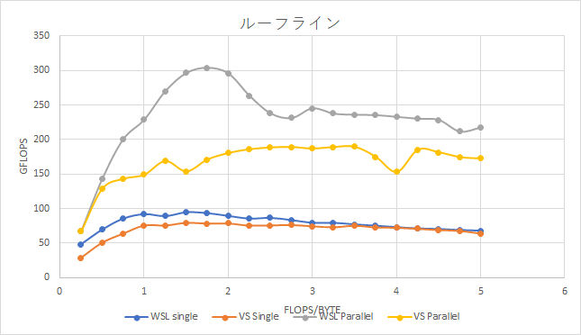

# ネットワーク系演習II 高能率計算　1回目レポート
## 学籍番号：01234567

## 名前：名工 大

## 使用計算機環境情報
* CPU: [Intel Core i7 8650U 1.9GHz （ターボブースト4.2GHz） 4コア8スレッド](https://en.wikichip.org/wiki/intel/core_i7/i7-8650u)
* メモリ: 16GB
* OS: Windows 10 with Windows subsystem for Linux (WSL1)
* コンパイラ: g++

CPUの詳細情報は以下等で調べてください．
https://en.wikichip.org/wiki/WikiChip

# 課題１
ソースコードの計測部分前後にタイマー関数を追記して実行速度を計測した．

なんどか実行した結果の実行時間の例を以下に示す．

```
1回目：ｘｘｘｘ
２回目：ｘｘｘｘ
．．．

ｎ回目：ｘｘｘｘ
```

考察：計算時間にはばらつきが観測できたが，おおむね一回目の計測時間が遅かった．

# 課題２
コンパイラオプションをO0~Ofastに変えてプログラムをコンパイルした．

結果は以下のようになった

* O0：xx ms
* O1：xx ms
* O2：xx ms
* O3：xx ms
* Ofast：xx ms

考察：Ofastが最も速かった．またコンパイル時間も最も長かった．O0とO1の実行速度の差は顕著だが，O1～3の差はごくわずかであり，優位な差を計測するにはより大きなサイズの行列で計測する必要があると考えられる．

# 課題３
以下のようにコードを書き換えた．

書き換え前
```cpp
const float v = x.data[i];
ret.data[i] = 3.f * v * v * v * v * v * v
    + 3.f * v * v * v * v * v
    + 3.f * v * v * v * v
    + 3.f;

```
書き換え後
```cpp
const float v = x.data[i];
//ret.data[i] = XXXXXXX;
```

考察：ｘｘｘｘｘｘｘｘｘｘｘ


# 課題４

表１：表のサンプル
|項目|時間|
|------|-----|
|展開前|xx ms|
|展開後|xx ms|

．．．


# 課題２２

画像の張り付けサンプル


図ｘ：シングルスレッドとマルチスレッドのルーフライン．

参考までに，CSEは1.3TFLOPSくらい出ます（試すのは絶対に夜中で．）．

．．．

# 課題２９


# 画像処理課題１

# 画像処理課題２

1回目の課題はここまで．
画像処理の共通の課題である上記１，２を忘れずにやること．
これ以降の課題は2回目のレポートです．

