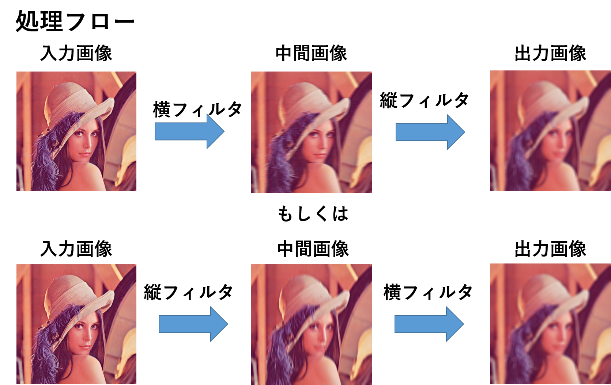

# 画像処理演習
## 目的
これまで学んだ高速化手法を応用し，画像処理における基本的な処理であるボックスフィルタを高速化する．

## ボックスフィルタ
ボックスフィルタとは，平滑化フィルタと呼ばれるフィルタの一種である．
このフィルタは，移動平均を行うフィルタである．
フィルタリングを行う範囲がボックスであるため，この様に呼ばれる．
画像処理において，平滑化はノイズ除去を始めとして，様々な用途で使用される．
そのため，ボックスフィルタの応用例は非常に幅広い．

---

## ボックスフィルタの実装
### ボックスフィルタのアルゴリズム
ボックスフィルタはFIRフィルタとして定義される．
FIRフィルタは次式で定義される．


ボックスフィルタでは，注目画素を中心とした正方形の範囲の画素の平均を求めるように定義され，重み関数は次式となる．

### 画像のデータ構造
一般的な画像のデータ構造は，AoSである．
画素は，3つのR，G，Bのチャネルを持つ構造体で表現される．
そして，それらを配列に格納した状態が一般的な画像のデータ構造である．
このとき，左上から列優先で配列に格納されている．
SIMD演算を用いる場合，AoSではロードを連続して取れないため，チャネル毎を1つの画像に変換して処理を行う．
つまり，AoSからSoAに変換を行うことが一般的である．

```cpp
//AoS
Pixel img[width*height]
struct Pixel
{
  unsigned char r;
  unsigned char g;
  unsigned char b;
}

//SoA
struct Image
{
  unsigned char r[width*hight];
  unsigned char g[width*hight];
  unsigned char b[width*hight];
}
```

### FIRフィルタにおけるループ構造
FIRフィルタは，カラー画像の場合，5つのループから構成される．
それは，外側から順に画素を走査するy，xの二重ループ，参照画素を走査するj，iの2重ループ，チャネルを走査する1重ループである．
ここでは，これらのループを順に，画素ループ，カーネルループ，カラーループと呼ぶ．
カラーループは通常RGBの3つしかないため，すでにループ展開されていることが一般的である．
```cpp
for(int y=0;y<heigh;y++) //画素ループ（y方向）
{
  for(int x=0;x<width;x++) //画素ループ（x方向）
  {
    for(int j=0;j<kerne_heigh;j++) //カーネルループ（y方向）
    {
      for(int i=0;i<kernel_width;i++) //カーネルループ（x方向）
      {
        for(int c=0;c<3;c++) //カラーループ
        {
          //img[y+j][x+i][c]への処理
        }
        //一般的には次のようにカラーループは展開されることが多い
        //img[y+j][x+i][0]への処理
        //img[y+j][x+i][1]への処理
        //img[y+j][x+i][2]への処理
      }
    }
  }
}
```

### 演習1
1. カラー画像におけるボックスフィルタをスカラーで実装せよ．
このとき，入力画像のデータ型をfloatとunsigned char（uchar）の2種類とし，画像のデータ構造をSoAに変換する場合の2種類の実装を行い，計算時間を測定せよ．
これらの実装については，データ構造変換の時間は含めず，カラーループは展開せよ．
なお，AoSのスカラ実装はサンプルコードで提供している．

    実装すべきものは下記の4つになる．
    - 入力画像float型・スカラ実装・SoA
    - 入力画像uchar型・スカラ実装・SoA

    実装に関しては，AoS・SoA変換にはsplitやmerge，端点の処理の簡便化にはcopyMakeBorderなど，ライブラリが提供している関数を適時使用せよ．


2. サンプルコードで提供されているAoS実装と1.で実装したSoA実装の計算時間を比較し，計算時間の違いをキャッシュ効率の観点より考察せよ．


## ボックスフィルタの高速化
### スレッド並列化
ボックスフィルタは，FIRフィルタであるため，合計5つのループが存在する．
それぞれのループで並列化を行うことが可能である．
ただし，ループを並列化する場合，最も外側のループに適用した方が並列化の粒度の観点より効率がいい．

### 演習2
1. 演習1で実装したスカラーコードをOpenMPでスレッド並列化せよ．
並列化するループは画素ループとカーネルループとする．
そして，それぞれを比較して最も外側のループを並列化する場合が最も効率が良いことを確認し，考察せよ．

    実装すべきものは下記の2つである．
    - 入力画像float型・スカラ実装・SoA・画素ループ並列化
    - 入力画像float型・スカラ実装・SoA・カーネルループ並列化

2. 画素ループ並列化のコードにおいて，並列化数を変更して計算時間を確認せよ．
そして，対応する並列化なし実装とも比較を行い，並列化効率などの観点から，考察せよ．


### SIMD実装
#### ループ展開
FIRフィルタをSIMDで実装する場合，以下に示す各ループで展開することが可能である．

##### カラーループ展開
カラーループは，もっとも内側のループである．
また，他のループに比べて，短いループであるため，ループ展開を既にした状態で記述することが一般的である．
SIMD命令によるベクトル化をこのループに適用する場合，ベクトル長に対して要素数が少なすぎるため，データ構造を変換する必要がある．
```cpp
pixel_before[width*height]
struct pixel_before
{
  float r;
  float g;
  float b;
}

pixel_after[width*height]
struct pixel_after
{
  float r;
  float g;
  float b;
  float padding[5] = {0};
}
```
このループ展開は，通常のカラーループでは，ベクトル化率が悪いため，効率は良くない．
また，最も内側のループであるため，並列化の粒度からいっても細かいため，あまり有効でない．
ほとんどのカラー画像は3チャネル固定であるため，単純なカラーループ展開は常に行うことが一般的である．

```cpp
//4要素を処理する場合（SSEに相当）
zeroPadding();
for(int y=0; y<img_height; y++){        
  for(int x=0; x<img_width; x++){
    sum[4] = {0};
    weight_sum = 0;
    for(int j=0; j<kernel_height; j++){         			
      for(int i=0; i<kernel_width; i++){
        temp_weight = calcWeight(j, i, y, x);
        sum[0] += temp_weight * I[y+j][x+i][0];
        sum[1] += temp_weight * I[y+j][x+i][1];
        sum[2] += temp_weight * I[y+j][x+i][2];
        sum[3] += temp_weight * I[y+i][x+i][3];// always 0
        weight_sum += temp_weight;
      }
    }
    for(int c=0;i<channels;c++){
      D[y][x][c] = sum[c]/weight_sum;
    }
  }
}
```

### カーネルループ展開
カーネルループ展開は，SIMD演算を使用する場合に最も最初に思いつきやすい方法である．
ただし，後述の画素ループ展開の方が効率がいい．
これでは，参照画素を走査するカーネル内の処理をSIMD演算によって並列化する．
しかし，連続したデータは行単位でしか取得することができないので，そこで余り処理が発生する．
また，奇数x奇数のカーネルで処理することが一般的であり，2のべき乗の倍数に合わすことはできない．
この場合，余り処理を行うために，set/gather命令を使用するか，画像を大きく拡張し，処理の際に必要でない部分の処理を行わないようにするなどの工夫が必要である．

この方法では，前処理としてAoSからSoAへの変換が必要である．
storeに関しては，スカラとしてstoreを行う．

```cpp
//4要素を処理する場合（SSEに相当）
convertSoA();
for(int y=0; y<img_height; y++){        
  for(int x=0; x<img_width; x++){
    sum[channels] = {0};
    weight_sum = 0;
    temp_weight_sum[4] = {0;}
    for(int j=0; j<kernel_height; j++){         			
      for(int i=0; i<kernel_width; i+=4){
        temp_weight[4] = {0};
        temp_weight[0] = calcWeight(j, i+0, y, x);
        temp_weight[1] = calcWeight(j, i+1, y, x);
        temp_weight[2] = calcWeight(j, i+2, y, x);
        temp_weight[3] = calcWeight(j, i+3, y, x);
        for(int c=0; i<channels; c++){
          sum[c] += temp_weight[0] * I[c][y+j][x+i+0];
          sum[c] += temp_weight[1] * I[c][y+j][x+i+1];
          sum[c] += temp_weight[2] * I[c][y+j][x+i+2];
          sum[c] += temp_weight[3] * I[c][y+j][x+i+3];
        }
        temp_weight_sum[0] += temp_weight[0];
        temp_weight_sum[1] += temp_weight[1];
        temp_weight_sum[2] += temp_weight[2];
        temp_weight_sum[3] += temp_weight[3];
      }
      residual_processing();
    }
    weight_sum += temp_weight_sum[0];
    weight_sum += temp_weight_sum[1];
    weight_sum += temp_weight_sum[2];
    weight_sum += temp_weight_sum[3];
    for(int c=0;i<channels;c++){
      D[y][x][c] = sum[c]/weight_sum;
    }
  }
}
```

### 画素ループ展開
最も外側のループを展開する方法である．
なお，データの並びの関係でxを展開するので実際は一つ中のループである．
これは，ある注目画素における処理をSIMD演算によって並列化するという考え方である．
SIMD演算を適用する場合，最も粒状度が大きい方法であり，効果が高い．
なお，画像の横幅が2のべき乗の倍数である必要があり，画像を拡張するか，余り処理が必要となる．

この方法では，AoSからSoAへの変換が前処理として必要となる．
また，SoAとして保存し，AoSに変換する後処理が必要である．
SoAと保存することで，SIMD命令を使用したstoreが可能である．

```cpp
//4要素を処理する場合（SSEに相当）
convertSoA();
for(int y=0; y<img_height; y++){                					
  for(int x=0; x<img_width; x+=4){
    sum[channels][4] = {0};
    weight_sum[4] = {0};
    for(int j=0; j<kernel_height; j++){         			
      for(int i=0; i<kernel_width; i++){
        temp_weight[4] = {0};
        temp_weight[0] = calcWeight(j, i, y, x+0);
        temp_weight[1] = calcWeight(j, i, y, x+1);
        temp_weight[2] = calcWeight(j, i, y, x+2);
        temp_weight[3] = calcWeight(j, i, y, x+3);
        for(int c=0; i<channels; c++){        	
	         sum[c][0] += temp_weight * I[c][y+j][x+i+0];
	          sum[c][1] += temp_weight * I[c][y+j][x+i+1];
	           sum[c][2] += temp_weight * I[c][y+j][x+i+2];
	            sum[c][3] += temp_weight * I[c][y+j][x+i+3];
            }
            weight_sum[0] += temp_weight[0];
            weight_sum[1] += temp_weight[1];
            weight_sum[2] += temp_weight[2];
            weight_sum[3] += temp_weight[3];
          }
        }
        residual_processing();
        for(int c=0;i<channels;c++){
          D[c][y][x+0] = sum[c][0]/weight_sum[0];
          D[c][y][x+1] = sum[c][1]/weight_sum[1];
          D[c][y][x+2] = sum[c][2]/weight_sum[2];
          D[c][y][x+3] = sum[c][3]/weight_sum[3];
        }
      }
}
convertAoS();
```

### 演習3
1. 演習2で実装したコードをSIMD実装に拡張せよ．
実装は，前述のカーネルループ展開，画素ループ展開を実装せよ．

    実装すべきものは次の2つである．
    - 入力画像float型・SIMD実装・SoA・画素ループ並列化・画素ループ展開
    - 入力画像float型・SIMD実装・SoA・画素ループ並列化・カーネルループ展開

2. 1.で実装したコードに対応するスカラ実装の計算時間を比較し，SIMD実装にしたことによる高速化率や，画素ループ展開とカーネルループ展開の効率の違いなどを考察せよ．


#### 型変換
画像のデータ型は，0~255のunsigned char型で格納されているのが一般的である．
しかし，何らかしらの処理を行う場合，float型に変換する必要がでてくる．
この場合，SIMD命令の`unpack`と`cvt`命令を用いることで型変換を実現する．
**なお，128ビット境界で，データを跨ぐことができないので注意が必要である**
256bitのデータをunpackで4本のベクトルに変換すると以下の順序となって分解される．
```cpp
//md0:  0,  1,  2,  3, 16, 17, 18, 19,
//md1:  4,  5,  6,  7, 20, 21, 22, 23,
//md2:  8,  9, 10, 11, 24, 25, 26, 27,
//md3: 12, 13, 14, 15, 28, 29, 30, 31,
```
画像処理の場合は大体この状態で十分である場合が多くそのままでよいならそのままで行う．
必要であればpermute命令を使用する．ただし，128ビット境界をまたぐpermute命令はunpack命令などよりも3倍くらい遅い．

```cpp
//Iは画像データ（画素の配列），データ構造変換でチャネル毎に1枚の画像に変換している．
__m256i md_8u = _mm256_load_si256(img); //unsigned char 32
//md_8u
// 0,  1,  2,  3,  4,  5,  6,  7,  8,  9, 10, 11, 12, 13, 14, 15,
//16, 17, 18, 19, 20, 21, 22, 23, 24, 25, 26, 27, 28, 29, 30, 31

const __m256i zero = _mm256_setzero_si256();
__m256i tmp = _mm256_unpacklo_epi8(md_8u, zero);
__m256i tmpp = _mm256_unpacklo_epi16(tmp, zero);
__m256  md0 = _mm256_cvtepi32_ps(tmpp);

tmpp = _mm256_unpackhi_epi16(tmp, zero);
__m256  md1 = _mm256_cvtepi32_ps(tmpp);

tmp = _mm256_unpackhi_epi8(md_8u, zero);
tmpp = _mm256_unpacklo_epi16(tmp, zero);
__m256  md2 = _mm256_cvtepi32_ps(tmpp);

tmpp = _mm256_unpackhi_epi16(tmp, zero);
__m256  md3 = _mm256_cvtepi32_ps(tmpp);

//md0:  0,  1,  2,  3, 16, 17, 18, 19,
//md1:  4,  5,  6,  7, 20, 21, 22, 23,
//md2:  8,  9, 10, 11, 24, 25, 26, 27,
//md3: 12, 13, 14, 15, 28, 29, 30, 31,
```

### 演習4
1. 演習4で実装したfloat型実装をuchar型実装に拡張せよ．

    実装に必要なものは，次の1つである．
    - 入力画像uchar型・SIMD実装・SoA・画素ループ並列化・画素ループ展開

2. 1.で実装したuchar型実装と対応するfloat型の計算時間と比較し，メモリI/Oやキャッシュ効率の観点から考察せよ．

### セパラブルフィルタ
FIRフィルタによる畳み込みは，重み関数が可分性を持つ場合に限り，縦と横方向の1次元の畳み込みに分割することができる．
例えば，ボックスフィルタやガウシアンフィルタがそれに当たる．
これは，縦方向に1次元で畳み込んだ後に，横方向に1次元で畳み込んだ結果と，2次元で畳み込んだ結果が同じ結果になることを示している．

２次元畳み込みの式は下記となる．


TODO:

また，これを１次元畳み込みの式に分解すると以下となる．


イメージ図は以下の通り．




<!--
```math
J_{\bm{p}} = \sum_{\bm{q} \in N_{\bm{p}}} G_{\sigma}(\bm{p},\bm{q}) I_{\bm{q}}
G_{\sigma}(\bm{p},\bm{q}) = \exp \Bigl(\frac{(p_x-q_x)^2+(p_y-q_y)^2}{-2 \sigma^2}\Bigr) \quad \bm{p}=(p_x, p_y),\bm{q}=(q_x, q_y)

J_{\bm{p}}^H = \sum_{\bm{q} \in N_{\bm{p}}^H} G^H_{\sigma}(p_x,q_x) I_{\bm{q}}
J_{\bm{p}} = \sum_{\bm{q} \in N_{\bm{p}}^V} G^V_{\sigma}(p_y,q_y) J_{\bm{q}}^H
G_{\sigma}^H(p_x,q_x) = \exp \Bigl(\frac{(p_x-q_x)^2}{-2 \sigma^2}\Bigr)
G_{\sigma}^V(p_y,q_y) = \exp \Bigl(\frac{(p_y-q_y)^2}{-2 \sigma^2}\Bigr)
```
-->

FIRフィルタにおける畳み込みが縦横の2次元から，2回の1次元の畳み込みになるため，計算オーダーが`O(r^2)`から`O(r)`になる．

### 演習4
1. 演習3で実装したコードとスカラ実装について，セパラブルフィルタに拡張せよ．

    必要な実装は次の2つである．
    - 入力画像uchar型・スカラ実装・SoA・画素ループ並列化・画素ループ展開
    - 入力画像uchar型・SIMD実装・SoA・画素ループ並列化・画素ループ展開（ただし，横フィルタに関してはSIMD実装は困難であるため，実装しなくても良い）

2. セパラブルフィルタによる高速化率が`O(r)`と`O(r^2)`との関係に従うか調べ，考察せよ．


### 演習5
演習2から演習4までに次の高速化に寄与する要素の組み合わせを実装してきた．
これまでの，演習結果を踏まえて，高速なボックスフィルタの実装について論じよ．

- データ構造：SoA・AoS
- 実装：スカラ実装・SIMD実装
- 並列化：画素ループ並列化・カーネルループ並列化
- ループ展開：画素ループ展開・カーネルループ展開
- データ型：uchar型・float型
- アルゴリズム：ナイーブアルゴリズム・セパラブルアルゴリズム
