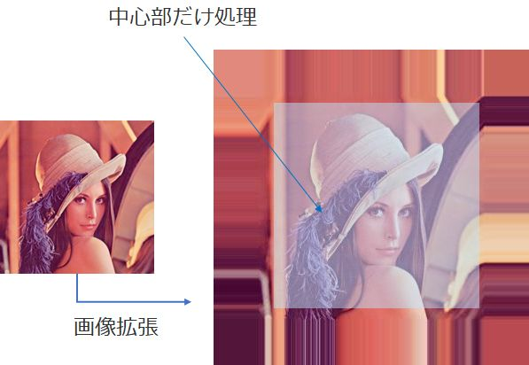
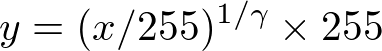
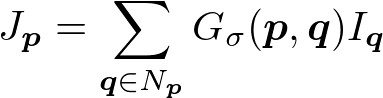
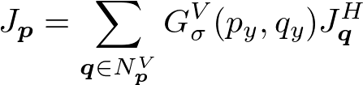
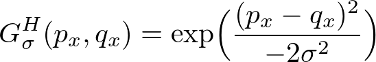

# 演習用画像処理用ライブラリの説明
ここでは，提供している画像処理用の簡易ライブラリの説明する．
詳細に関しては，サンプルコードも参照すること．
* [画像処理ライブラリとサンプルコード](https://github.com/fukushimalab/hpc_exercise/tree/master/src/image-processing)

なお，実際に研究などで画像処理を行う場合は[OpenCV](https://opencv.org/)などの専用のライブラリがあり，これらのライブラリは非常に関数が充実しているためそれを用いるほうが効率的である．

## Imageクラス
Matクラスとほんと同じ仕様である．
ただし，画像の色情報であるB（青），G（緑），R（赤）を保持するために，channels変数が追加している．
型の変換は，各Imageクラスのコンストラクタで変換すること．
データへのアクセスはチャネルが追加されているため，Matでのアクセスとは違った以下のようにアクセスする必要があることを注意すること．

```cpp
Image_8U a(row, col, channel);
//i行，j列,c番目のチャネルへのアクセス
a.data[a.channels*(i*a.cols + j)+c];
```

なお，画像の読み込み書き込みは，以下のユーティリティ関数である，`readPXM・writePXM`で可能である．
保存形式はグレイ画像はpgm，カラー画像はppmである．

フォーマットの詳細は以下のリンクを参照のこと．
[PNM (画像フォーマット)](https://ja.wikipedia.org/wiki/PNM_(%E7%94%BB%E5%83%8F%E3%83%95%E3%82%A9%E3%83%BC%E3%83%9E%E3%83%83%E3%83%88))


データの型の変換は以下のように行う．
```cpp
Image_8U i8u_1(row, col, channel);
Image_32F i32f(i8u_1); //8Uから32Fへの変換

Image_8U i8u_2(i32f); //32Fから8Uへの変換
```

#### チュートリアル課題1
カラー画像を読み込みグレイ画像に変換して，グレイ画像をpgmとして保存したのちに，pgm画像を確認せよ．
なお，`cvtColorGray`関数を用いればよい（cvtはconvertの略）．
画像の確認には，フォルダを開いてダブルクリックするか，適切なlinuxのコマンドを打てばよい．

#### チュートリアル課題2
グレイの画像に対して縦横50マスづつ黒く埋める（0を入れる）プログラムを書け，
なお，結果はpgmで保存して出力画像を確認せよ．

#### チュートリアル課題3
カラーで画像を読み込み，緑成分だけ2倍にするプログラムを書け．
なお，結果はppmで保存して出力画像を確認せよ．
まず，単純に画素値を二倍して出力を確認せよ．
そうすると，8bit(uchar)の範囲は0-255のため単純に2倍するとその範囲を超えて値が飽和する．
その結果，画素値が想定とは異なった値になっている．
その場合は，出力を0-255の値に収まるように以下脳ようにクリップするとよい．

```cpp
y=min(max(2*x,0),255);
```

もちろん以下のように条件分岐で書いてもよい（が，上記のほうが可読性が高いかつ速度も速い）
```cpp
int val = 2*x;
if(val>255) val = 255
else if(val<0)val=0;
y=mval;
```

また，この2倍に限定すれば，マイナスになることが想定されないため，以下だけで十分である．

```cpp
y=min(2*x,,255);

```
## ユーティリティ関数
### readPXM・writePXM
readPXM関数は，ppm及びpgmファイルをImage_8Uとして読み込み込む．
writePXM関数は，Image_8Uオブジェクトをppm及びpgmファイルとして書き込みを行う．

### cvtColorGray
カラー画像をグレー画像に変換する関数．
BGRの３チャネルのデータを（B+G+R)/3として１チャネルのグレイ画像に変換する．

### copyMakeBorder
フィルタ処理において，端点を処理するために画像を拡張する関数．
top，bottom，left，right方向，それぞれを拡張する．

畳み込み演算のコードは，範囲を処理するため，画像の端点では参照画素が外側にはみ出る．
例えば３ｘ３の範囲で平均する場合の(0,0)の画素では，(-1,-1)など存在しない画素にアクセスする．
その場合，セグメンテーションフォルトを起こすため，負の値だった場合にどのような処理をするのか正しく例外処理をプログラムに記述する必要がある．
画像の場合はおおむね左上角，上，右上角，左，右，左下角，下，右下角と中央の９領域に分割でき，中央以外は例外処理が必要になる．

このcopyMakeBorder関数は，プログラムとして例外処理をしないために端点を拡張して用いる．
この関数は，引数で指定された画像のサイズ分だけ端点の画素を引き延ばして拡張している．
その後，増えたサイズの内側だけ処理することで，例外処理を発生させないようにしている．



### split・merge
splitは，BGRBGR...とインタリーブして画素値が並ぶ状態のImageオブジェクトを各チャネル毎の画像に変換する関数．つまりSoAからAoSの変換を行う．
基本的に画像はこのようなデータ構造をとることが多い．

mergeは，splitで変換した各チャネル画像を持つImageオブジェクトの配列を1つのImageオブジェクトに変換する．

これらの関数は，SIMD命令を使用する際に，データが連続するように変換するためにsplitを行ったり，それを戻すためにmergeを読んだりするために必要です．


---
# 画像処理の高速化（総合演習用（共通））
## ガンマ変換
ガンマ変換とは，画像の輝度値を次式に従い変換する処理である．



<!--
```math
y = (x/255)^{1/gamma}\times 255
```
-->

ガンマ変換の実装は，以下のようになる．
```cpp
const float gamma = 2.2;
Image src;
Image dest;
for(int y = 0; y < height; y++)
{
  for(int x = 0; x < width; x++)
  {
    dest.data[y*width+x] = pow(src.data[y*width+x]/255.f, 1.f/gamma)*255.f;
  }
}
```

### 課題１

ガンマ変換を高速化せよ．
高速化方法としては，次の方法が挙げられる．
* LUTを使用して演算の削減
* ループ潰し
* スレッド並列化
* SIMDによる実装

*注意*

image-processing/main.cppのmain関数にプロトタイプ宣言されたガンマ関数がある．
`void GammaCorrection`がmain関数の下に定義されているので，それをコピーしてGammaCorrectionFastなどの関数を作り直して高速化するとよい．
また，高速化の結果，バグや数値計算の順序によって演算結果が変わっている可能性があるためPSNR等で正しく挙動しているか確認するとよい．

この注意点は以下の課題でも同じである．

## 画像の平均・分散計算
画像のすべての画素値の平均値・分散値を計算するのは，リダクション計算となり，効率的に計算するには多少の工夫が必要となる．

### 課題２
画像画素値の平均値，分散値をそれぞれで求めよ．
高速化方法としては，次の方法によって高速化できる．
* スレッド並列化
* ループ潰し
* SIMD

なお，ベクトル化などを行った結果，浮動小数点の情報落ちなどによって数値計算の結果が元のコードと異なる場合がある．
総和演算では比較的よく発生し，[カハンの加算アルゴリズム](https://ja.wikipedia.org/wiki/%E3%82%AB%E3%83%8F%E3%83%B3%E3%81%AE%E5%8A%A0%E7%AE%97%E3%82%A2%E3%83%AB%E3%82%B4%E3%83%AA%E3%82%BA%E3%83%A0)などで対応可能である．ただし速度は大幅に遅くなる．

なお，ベクトル化したほうが，総和の値としては正しい値を返すことが多い．（[Pairwise summation](https://en.wikipedia.org/wiki/Pairwise_summation)を調べると詳細がわかる．）
正しい値かどうかは，doubleで計算した総和結果を正解として，floatで総和を計算したものを比較すればよい．

<!--
## FIRフィルタ
FIRフィルタによる畳み込みは，重み関数が可分性を持つ場合に限り，縦と横方向の1次元の畳み込みに分割することができる．
例えば，ガウシアンフィルタがそれに当たる．
これは，縦方向に1次元で畳み込んだ後に，横方向に1次元で畳み込んだ結果と，2次元で畳み込んだ結果が同じ結果になることを示している．

２次元畳み込みの式は下記となる．




また，これを１次元畳み込みの式に分解すると以下となる．







イメージ図は以下の通り．


<!--
```math
J_{\bm{p}} = \sum_{\bm{q} \in N_{\bm{p}}} G_{\sigma}(\bm{p},\bm{q}) I_{\bm{q}}
G_{\sigma}(\bm{p},\bm{q}) = \exp \Bigl(\frac{(p_x-q_x)^2+(p_y-q_y)^2}{-2 \sigma^2}\Bigr) \quad \bm{p}=(p_x, p_y),\bm{q}=(q_x, q_y)

J_{\bm{p}}^H = \sum_{\bm{q} \in N_{\bm{p}}^H} G^H_{\sigma}(p_x,q_x) I_{\bm{q}}
J_{\bm{p}} = \sum_{\bm{q} \in N_{\bm{p}}^V} G^V_{\sigma}(p_y,q_y) J_{\bm{q}}^H
G_{\sigma}^H(p_x,q_x) = \exp \Bigl(\frac{(p_x-q_x)^2}{-2 \sigma^2}\Bigr)
G_{\sigma}^V(p_y,q_y) = \exp \Bigl(\frac{(p_y-q_y)^2}{-2 \sigma^2}\Bigr)
```


FIRフィルタにおける畳み込みが縦横の2次元から，2回の1次元の畳み込みになるため，計算オーダーが`O(r^2)`から`O(r)`になる．
なお，サンプルコードは，下記copyMakeBorder関数により例外処理が発生しないようになっている．

# ベクトル演算と並列化を用いた画像処理（発展）
ここでは，画像処理におけるベクトル演算と並列化を用いた高速化方法について記述する．

## 画像のデータ構造
一般的な画像のデータ構造は，AoSである．
画素は，3つのR，G，Bのチャネルを持つ構造体で表現される．
そして，それらを配列に格納した状態が一般的な画像のデータ構造である．
このとき，左上から列優先で配列に格納されている．
SIMD演算を用いる場合，AoSではロードを連続して取れないため，チャネル毎を1つの画像に変換して処理を行う．
つまり，AoSからSoAに変換を行うことが一般的である．
```cpp
//AoS
Pixel img[width*height]
struct Pixel
{
  unsigned char r;
  unsigned char g;
  unsigned char b;
}

//SoA
struct Image
{
  unsigned char r[width*hight];
  unsigned char g[width*hight];
  unsigned char b[width*hight];
}
```

## 型変換
画像のデータ型は，0~255のunsigned char型で格納されているのが一般的である．
しかし，何らかしらの処理を行う場合，float型に変換する必要がでてくる．
この場合，SIMD命令の`unpack`と`cvt`命令を用いることで型変換を実現する．
**なお，128ビット境界で，データを跨ぐことができないので注意が必要である**
256bitのデータをunpackで4本のベクトルに変換すると以下の順序となって分解される．
```cpp
//md0:  0,  1,  2,  3, 16, 17, 18, 19,
//md1:  4,  5,  6,  7, 20, 21, 22, 23,
//md2:  8,  9, 10, 11, 24, 25, 26, 27,
//md3: 12, 13, 14, 15, 28, 29, 30, 31,
```
画像処理の場合は大体この状態で十分である場合が多くそのままでよいならそのままで行う．
必要であればpermute命令を使用する．ただし，128ビット境界をまたぐpermute命令はunpack命令などよりも3倍くらい遅い．

```cpp
//Iは画像データ（画素の配列），データ構造変換でチャネル毎に1枚の画像に変換している．
__m256i md_8u = _mm256_load_si256(img); //unsigned char 32
//md_8u
// 0,  1,  2,  3,  4,  5,  6,  7,  8,  9, 10, 11, 12, 13, 14, 15,
//16, 17, 18, 19, 20, 21, 22, 23, 24, 25, 26, 27, 28, 29, 30, 31

const __m256i zero = _mm256_setzero_si256();
__m256i tmp = _mm256_unpacklo_epi8(md_8u, zero);
__m256i tmpp = _mm256_unpacklo_epi16(tmp, zero);
__m256  md0 = _mm256_cvtepi32_ps(tmpp);

tmpp = _mm256_unpackhi_epi16(tmp, zero);
__m256  md1 = _mm256_cvtepi32_ps(tmpp);

tmp = _mm256_unpackhi_epi8(md_8u, zero);
tmpp = _mm256_unpacklo_epi16(tmp, zero);
__m256  md2 = _mm256_cvtepi32_ps(tmpp);

tmpp = _mm256_unpackhi_epi16(tmp, zero);
__m256  md3 = _mm256_cvtepi32_ps(tmpp);

//md0:  0,  1,  2,  3, 16, 17, 18, 19,
//md1:  4,  5,  6,  7, 20, 21, 22, 23,
//md2:  8,  9, 10, 11, 24, 25, 26, 27,
//md3: 12, 13, 14, 15, 28, 29, 30, 31,
```

## FIRフィルタにおけるループ展開
FIRフィルタは，カラー画像の場合，5つのループから構成される．
それは，外側から順に画素を走査するy，xの二重ループ，参照画素を走査するj，iの2重ループ，チャネルを走査する1重ループである．
ここでは，これらのループを順に，画素ループ，カーネルループ，カラーループと呼ぶ．
つまり，FIRフィルタ処理におけるベクトル化には，3つのループ展開方法がある．
```cpp
for(int y=0;y<heigh;y++) //画素ループ（y方向）
{
  for(int x=0;x<width;x++) //画素ループ（x方向）
  {
    for(int j=0;j<kerne_heigh;j++) //カーネルループ（y方向）
    {
      for(int i=0;i<kernel_width;i++) //カーネルループ（x方向）
      {
        for(int c=0;c<3;c++) //カラーループ
        {
          //img[y+j][x+i][c]への処理
        }
      }
    }
  }
}
```

### カラーループ展開
カラーループは，もっとも内側のループである．
また，他のループに比べて，短いループであるため，ループ展開を既にした状態で記述することが一般的である．
SIMD命令によるベクトル化をこのループに適用する場合，ベクトル長に対して要素数が少なすぎるため，データ構造を変換する必要がある．
```cpp
pixel_before[width*height]
struct pixel_before
{
  float r;
  float g;
  float b;
}

pixel_after[width*height]
struct pixel_after
{
  float r;
  float g;
  float b;
  float padding[5] = {0};
}
```
このループ展開は，通常のカラーループでは，ベクトル化率が悪いため，効率は良くない．
また，最も内側のループであるため，並列化の粒度からいっても細かいため，あまり有効でない．
ほとんどのカラー画像は3チャネル固定であるため，単純なカラーループ展開は常に行うことが一般的である．

```cpp
//4要素を処理する場合（SSEに相当）
zeroPadding();
for(int y=0; y<img_height; y++){        
  for(int x=0; x<img_width; x++){
    sum[4] = {0};
    weight_sum = 0;
    for(int j=0; j<kernel_height; j++){         			
      for(int i=0; i<kernel_width; i++){
        temp_weight = calcWeight(j, i, y, x);
        sum[0] += temp_weight * I[y+j][x+i][0];
        sum[1] += temp_weight * I[y+j][x+i][1];
        sum[2] += temp_weight * I[y+j][x+i][2];
        sum[3] += temp_weight * I[y+i][x+i][3];// always 0
        weight_sum += temp_weight;
      }
    }
    for(int c=0;i<channels;c++){
      D[y][x][c] = sum[c]/weight_sum;
    }
  }
}
```

### カーネルループ展開
カーネルループ展開は，SIMD演算を使用する場合に最も最初に思いつきやすい方法である．
ただし，後述の画素ループ展開の方が効率がいい．
これでは，参照画素を走査するカーネル内の処理をSIMD演算によって並列化する．
しかし，連続したデータは行単位でしか取得することができないので，そこで余り処理が発生する．
また，奇数x奇数のカーネルで処理することが一般的であり，2のべき乗の倍数に合わすことはできない．
この場合，余り処理を行うために，set/gather命令を使用するか，画像を大きく拡張し，処理の際に必要でない部分の処理を行わないようにするなどの工夫が必要である．

この方法では，前処理としてAoSからSoAへの変換が必要である．
storeに関しては，スカラとしてstoreを行う．

```cpp
//4要素を処理する場合（SSEに相当）
convertSoA();
for(int y=0; y<img_height; y++){        
  for(int x=0; x<img_width; x++){
    sum[channels] = {0};
    weight_sum = 0;
    temp_weight_sum[4] = {0;}
    for(int j=0; j<kernel_height; j++){         			
      for(int i=0; i<kernel_width; i+=4){
        temp_weight[4] = {0};
        temp_weight[0] = calcWeight(j, i+0, y, x);
        temp_weight[1] = calcWeight(j, i+1, y, x);
        temp_weight[2] = calcWeight(j, i+2, y, x);
        temp_weight[3] = calcWeight(j, i+3, y, x);
        for(int c=0; i<channels; c++){
          sum[c] += temp_weight[0] * I[c][y+j][x+i+0];
          sum[c] += temp_weight[1] * I[c][y+j][x+i+1];
          sum[c] += temp_weight[2] * I[c][y+j][x+i+2];
          sum[c] += temp_weight[3] * I[c][y+j][x+i+3];
        }
        temp_weight_sum[0] += temp_weight[0];
        temp_weight_sum[1] += temp_weight[1];
        temp_weight_sum[2] += temp_weight[2];
        temp_weight_sum[3] += temp_weight[3];
      }
      residual_processing();
    }
    weight_sum += temp_weight_sum[0];
    weight_sum += temp_weight_sum[1];
    weight_sum += temp_weight_sum[2];
    weight_sum += temp_weight_sum[3];
    for(int c=0;i<channels;c++){
      D[y][x][c] = sum[c]/weight_sum;
    }
  }
}
```

### 画素ループ展開
最も外側のループを展開する方法である．
なお，データの並びの関係でxを展開するので実際は一つ中のループである．
これは，ある注目画素における処理をSIMD演算によって並列化するという考え方である．
SIMD演算を適用する場合，最も粒状度が大きい方法であり，効果が高い．
なお，画像の横幅が2のべき乗の倍数である必要があり，画像を拡張するか，余り処理が必要となる．

この方法では，AoSからSoAへの変換が前処理として必要となる．
また，SoAとして保存し，AoSに変換する後処理が必要である．
SoAと保存することで，SIMD命令を使用したstoreが可能である．

```cpp
//4要素を処理する場合（SSEに相当）
convertSoA();
for(int y=0; y<img_height; y++){                					
  for(int x=0; x<img_width; x+=4){
    sum[channels][4] = {0};
    weight_sum[4] = {0};
    for(int j=0; j<kernel_height; j++){         			
      for(int i=0; i<kernel_width; i++){
        temp_weight[4] = {0};
        temp_weight[0] = calcWeight(j, i, y, x+0);
        temp_weight[1] = calcWeight(j, i, y, x+1);
        temp_weight[2] = calcWeight(j, i, y, x+2);
        temp_weight[3] = calcWeight(j, i, y, x+3);
        for(int c=0; i<channels; c++){        	
	         sum[c][0] += temp_weight * I[c][y+j][x+i+0];
	          sum[c][1] += temp_weight * I[c][y+j][x+i+1];
	           sum[c][2] += temp_weight * I[c][y+j][x+i+2];
	            sum[c][3] += temp_weight * I[c][y+j][x+i+3];
            }
            weight_sum[0] += temp_weight[0];
            weight_sum[1] += temp_weight[1];
            weight_sum[2] += temp_weight[2];
            weight_sum[3] += temp_weight[3];
          }
        }
        residual_processing();
        for(int c=0;i<channels;c++){
          D[c][y][x+0] = sum[c][0]/weight_sum[0];
          D[c][y][x+1] = sum[c][1]/weight_sum[1];
          D[c][y][x+2] = sum[c][2]/weight_sum[2];
          D[c][y][x+3] = sum[c][3]/weight_sum[3];
        }
      }
}
convertAoS();
```

## スレッドレベル並列化との併用
粒状度が大きいレベルで並列化するのが最も良い方法である．
そのため，最も外側の画素ループ（y方向）を並列化するのが一般的である．
-->
___
